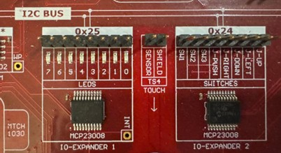

# **Lab 3: I2C with IO Expander 1 for LED Control and IO Expander 2 for Switch Input**

## Required Materials

* MP LAB X IDE and Compiler  
* Curiosity Nano AVR64DD32 board  
* USB to connect board to computer

## Learning Objectives

* Using MCC Melody  
* Viewing pin configurations  
* Configuring and using the I2C

## I2C Explanation

I2C (I-squared-C), or sometimes referred to as IIC, is a common communication protocol found on microcontroller and embedded systems, and was also covered in our Arduino based microcontroller course\! The basic idea is that it allows multiple peripherals to communicate with each other using only 2 data lines, one for the data itself (known as the SDA or serial data pin) and one for the clock (known as the SCL or serial clock pin). Controller(s) is involved that manages sending data to peripherals or other devices. As two devices communicate over only one data line, they take turns sending data rather than sending concurrently, which does slow down the process just a tiny bit. 

## IO Expanders on the Curiosity Nano

The Curiosity Nano Explorer Board is equipped with two MCP23008 I/O Expanders:

* IO Expander 1: Located at I2C hardware address 0x25.  
* IO Expander 2: Located at I2C hardware address 0x24.

In this lab, we will be communicating with both IO Expanders:

* We will be writing to IO Expander 1 (0x25) to create a bidirectional LED chaser.  
* We will be reading from IO Expander 2 (0x24) to detect switch presses from the MTCH1030.

## 

## I2C-Based Bidirectional LED Chaser on IO Expander 1 with MPLABX

1. **Overview**  
   This walkthrough explains how the **cycle\_leds()** function can control the amber LEDs in sequence using an I2C GPIO Expander (MCP23008) on MPLABX. We will use IO Expander 1 on the Curiosity Nano Explorer Board to illuminate the amber LEDs sequentially from right to left, one at a time, until reaching the last LED. Then, the sequence reverses, moving back from left to right, creating a back-and-forth sweeping effect.  
   

**📌 This lab can be found in Lab3/Code/mplab\_lab3.X**

2. **Necessary Directives, Definitions, and Function Declarations**  
   The following directives are required for the program to function correctly  
   

    #include "mcc\_generated\_files/system/system.h"
    #include "systimer.h"

   

1. **system.h** – This import directive was covered in Lab 1\. It includes our hardware-specific configuration header file.  
2. **systimer.h** – This lab splits out the soft timer support into another file called systimer.c. We include this directive to import that functionality into our main.c file.  
     
   The following definition specifies the I2C hardware address for the IO Expander 1 on the Curiosity Nano Explorer board:  
   

     #define ADDR_IOEX1   0x25

   The following function declaration allows the compiler to locate the corresponding function definition used in the main function:

     void cycle_leds(void);

## I2C-Based Bidirectional LED Chaser on IO Expander 1 with MPLABX cont.

3. **Initialization**  
   This is the main function of the program, which we covered in previous labs. This time, we will use only one timer, which will be cleared inside the **cycle\_leds** function.

    int main(void) {
        SYSTEM_Initialize();    
        Timer0.TimeoutCallbackRegister(tcb_softtimer);
        while (1) {          
            cycle_leds();
        }

4. **Program Execution: Variable Declarations**  
   The cycle_leds(void) function communicates with the IO Expander 1 at I2C address 0x25 to cycle through LEDs in a shifting pattern. It writes 8-bit numbers with LED combinations to the GPIO register (0x09), making the LEDs move back and forth in a bouncing effect. We start by initializing two variables:  
- **i2c_cmd[2]**: unsigned 8-bit array initialized to { 0x00, 0x00 }. We will use this to communicate with the IO Expander.  
  - i2c_cmd[0]: This byte holds the register address. It is initialized to 0x00, which corresponds to the address of the direction register (DIR), used to set the direction of each GPIO pin in the IO Expander.  
  - i2c_cmd[1]: This byte holds a combination of directions for each of the 8 pins. The value 0x00 (0b00000000) means that all pins are configured as outputs.  
- **cmd_len = 2**:  
  - This variable defines the length of the I2C transmission. It will send 2 bytes at a time.

    void cycle_leds(void){        
        uint8_t i2c_cmd[2] = { 0x00, 0x00 };
        size_t cmd_len = 2;
  

## I2C-Based Bidirectional LED Chaser on IO Expander 1 with MPLABX cont.

5. **Program Execution: Initial I2C Write**  
   The TWI0_Write function sends a two-byte command to the device. The first parameter is the I2C address of IO Expander 1. The second parameter uses the address of the i2c command array initialized in step 4 (look above) to specify the exact command and write value, and the third parameter dictates the length of the I2C transmission. This command sets all pins as outputs by writing the command from step 4 to IO Expander 1. The command while(TWI0_IsBusy()); ensures that the previous I2C write operation has completed before proceeding.

    TWI0_Write(ADDR_IOEX1, &i2c_cmd[0], cmd_len);
        while(TWI0_IsBusy()); 
 

6. **Program Execution: Configure Initial GPIO State.**  
   The following two lines configure the GPIO register for LED control. The first line specifies the GPIO register address (0x09), while the second line sets the initial LED pattern to 11111110\. Keep in mind that the Curiosity Nano Explorer Board uses active low logic for the LEDs. This means that we are turning on the first LED from right to left.

    i2c_cmd[0] = 0x09;
    i2c_cmd[1] = 0xFE; // 8-bit binary: 0b11111110. 
 

7. **Program Execution: Initialize the Direction of LED Shifting**  
   The **bool incr = true;** variable is used to track whether the LED pattern should shift left (true) or shift right (false).

    bool incr = true; 
 

8. **Program Execution: Initial Delay**  
   The command **clear_timer1();** resets the timer. The **while(read_timer1() < 500);** loop introduces a delay of 500 timer units before entering the main loop.

    clear_timer1();
    while(read_timer1() < 500); 
 

## I2C-Based Bidirectional LED Chaser on IO Expander 1 with MPLABX cont.

9. **Program Execution: Infinite Loop for LED Cycling:**  
   The loop runs indefinitely, continuously updating the LED pattern. **TWI0_Write(ADDR_IOEX1, &i2c_cmd[0], cmd_len);** sends the updated LED pattern to IO Expander 1. The command **while(TWI0_IsBusy());** ensures that the previous I2C write operation has completed before proceeding.

    while(true) {
        TWI0_Write(ADDR_IOEX1,&i2c_cmd[0], cmd_len);
        while(TWI0_IsBusy()); 
 

10. **Program Execution: Shifting LED Pattern:**  
    In the first command below, if **incr** is true, the LED pattern shifts left. The line shifts all bits left and ensures the rightmost bit remains 1, keeping the LEDs active in sequence. In the second command, if **incr** is false, the LED pattern shifts right. The line shifts all bits right while ensuring the leftmost bit remains 1.

        if (incr) i2c_cmd[1] = (i2c_cmd[1] << 1) | 0x01;            //(1)        
        else i2c_cmd[1] = (i2c_cmd[1] >> 1) | 0x80;                 //(2) 
 

11. **Program Execution: Direction Reversal:**  
    The condition i2c_cmd[1] == 0x7F on the next line checks if the LED pattern has reached either extreme. The hexadecimal numbers 0x7F (0111 1111) and 0xFE (1111 1110) are the boundary values where the shift direction needs to be reversed. If the LED pattern reaches one of the two boundary values, **incr = !incr;** toggles the direction.

        if (i2c_cmd[1] == 0x7F || i2c_cmd[1] == 0xFE) incr = !incr; 
 

    

12. **Program Execution: Delay Before Next Iteration:**  
    The timer is cleared again with clear_timer1(); and another delay of 500 timer units ensures a visible transition between LED states.

        clear_timer1();
        while(read_timer1() < 500); }

## 

## I2C-Based Switch Reading with MPLABX and IO Expander II

1. **Overview**  
   This function reads switch press states from IO Expander 2 (hardware address 0x24), which is connected to three push buttons (SW1, SW2, and SW3) and interfaces with the MTCH1030 capacitive touch controller. It uses I2C communication (via **TWI0_Write** and **TWI0_Read**) to retrieve switch states and send corresponding messages via UART.  
     
2. **Modifying Main to Add Switch Reading**  
   We will build on our existing program. Before implementing switch reading, we need to make a few modifications to ensure proper functionality when working with **IO Expander 2** at address **0x24**.  
     
   Include necessary header files:   

    #include <string.h>
    #include <stdio.h>

1. **string.h** – Required for string handling with strlen.  
2. **stdio.h** – Required for formatted output with sprintf.

	Define IO Expander 2 address:

    #define ADDR_IOEX2   0x24

Declare necessary functions and variables:

    void UART_WriteString(const char *message); // enables UART communication
    char uart_str[80];                      // provides a buffer for messages
    void read_switches(void);         // declares the switch-reading function

## I2C-Based Switch Reading with MPLABX and IO Expander II cont.

3. **Modifying Main to Add Switch Reading (Cont.)**  
   Modify main to support switch reading and UART. You may comment out the line to define a callback function for the timer because we do not use it in switch reading. More importantly, toggle between the **cycle_leds();** and **read_switches();** functions by commenting one out and leaving the other. Use **cycle_leds();** to display the bidirectional LED chaser and **read_switches();** to implement switch reading.  
   

    int main(void) {   
        SYSTEM_Initialize();   
        // Timer0.TimeoutCallbackRegister(tcb_softtimer);  // Comment this out  
        while (1)    {        
            // cycle_leds();                             // Comment this out 
            read_switches();                             // Add this line   }} 
 

4. **Program Execution: Initial Configuration**  
   The function begins by setting up communication with the IO Expander. We start by initializing two variables:  
   - **i2c_cmd[2]**: unsigned 8-bit array initialized to { 0x00, 0xFF }  
       - i2c_cmd[0]: Holds the direction register (DIR) to set the direction of each GPIO pin.  
       - i2c_cmd[1]: The value 0xFF (0b11111111) means that all pins are configured as inputs.

    void read_switches(void) {    
    uint8_t i2c_cmd[2] = {0x00, 0xFF};    size_t cmd_len = 2;

5. **Program Execution: Initial I2C Write**  
   The TWI0_Write function sends a two-byte command to the device. The first parameter is the I2C address of IO Expander 2.  This command sets all pins as **inputs** (unlike the outputs used in the LED chaser) by writing the command from step 3 to IO Expander 2. The command while(TWI0_IsBusy()); ensures that the previous I2C write operation has completed before proceeding.  
   

    TWI0_Write(ADDR_IOEX2,&i2c_cmd[0], cmd_len);    
    while(TWI0_IsBusy()); 
 

## I2C-Based Switch Reading with MPLABX and IO Expander II cont.

6. **Program Execution: Configuring Pull-Up Resistors**  
   The following two lines configure the GPIO Pull-Up Resistor (GPPU) register. It controls the internal 100 kΩ pull-up resistors for the IO Expander’s PORT pins. The first line specifies the GPIO register address (0x06), while the second line enables pull-ups on all pins, ensuring that when a switch is not pressed, the input reads as **logic high (1)**. TWI0_Write sends this configuration to IO Expander 2.  
   

    i2c_cmd[0] = 0x06; // GPPU register    
    i2c_cmd[1] = 0xFF; // Enable pull-ups on all pins.    
    TWI0_Write(ADDR_IOEX2, &i2c_cmd[0], cmd_len);   
    while(TWI0_IsBusy()); 
 

7. **Program Execution:  Main Loop**  
   Now we enter our main loop. It continuously monitors the switch states by reading from IO Expander 2. It starts by defining **last_state** as **0xFF**, which we will use to store the previous switch state to detect changes. The variable **i2c_cmd** is set to **0x09,** which is the GPIO register address, indicating that we will want to read GPIO data. The program first writes **0x09** to the IO Expander using **TWI0_Write**, effectively selecting the GPIO register. After ensuring the write operation is complete with **while(TWI0_IsBusy())**, it proceeds to read the switch state using **TWI0_Read**, storing the result in **switch_state**. Another **while(TWI0_IsBusy())** ensures that the read operation has finished before using the retrieved data. At this point, switch_state holds the latest pin states, which will be compared in the upcoming if statement to **last_state**.  
   

    while (true) {        
        static uint8_t last_state = 0xFF;              // All switches up
        uint8_t switch_state;        uint8_t i2c_cmd = 0x09;                // GPIO Register Selection

        TWI0_Write(ADDR_IOEX2, &i2c_cmd, 1);         // Request GPIO Data
        while (TWI0_IsBusy());

        TWI0_Read(ADDR_IOEX2, &switch_state, 1);   // Read the GPIO State
        while (TWI0_IsBusy());

## I2C-Based Switch Reading with MPLABX and IO Expander II cont.

8. **Program Execution:  Main Loop (Cont.)**  
   After retrieving the current switch state, the program enters the if statement to determine if a switch press event has occurred. The condition **switch_state != last_state** prevents redundant messages to only respond to state changes. The condition **switch_state != 0xFF** ensures that at least one switch is pressed, since 0xFF indicates that no switches are active. If the condition is met, the program updates **last_state** with the new **switch_state** to track the change. Next the switch statement checks switch_state against predefined bit patterns.  
   

        if (switch_state != last_state && switch_state != 0xFF) {
            last_state = switch_state;                        
            switch (switch_state) {
                case 0b01111111: // Left switch pressed   
                    sprintf(uart_str,"Left switch pressedrn");
                    break;                
                case 0b10111111: // Middle switch pressed   
                    sprintf(uart_str,"Middle switch pressedrn");      
                    break;                
                case 0b11011111: // Right switch pressed  
                    sprintf(uart_str,"Right switch pressedrn");       
                    break;          
                case 0b00111111: // Left & Middle pressed    
                    sprintf(uart_str, "Left and Middle switchesrn");    
                    break;              
                case 0b01011111: // Left & Right pressed        
                    sprintf(uart_str, "Left & Right switchesrn");     
                    break;               
                case 0b10011111: // Middle & Right pressed  
                    sprintf(uart_str, "Middle & Right switchesrn");     
                    break;                
                case 0b00011111: // All three switches pressed     
                    sprintf(uart_str, "All switches pressedrn");  
                    break;           
                } 
                UART_WriteString(uart_str);  
            }   
        } 

## I2C-Based Switch Reading with MPLABX and IO Expander II cont.

Each case corresponds to a unique switch press combination, where a 0 in a bit position indicates a pressed switch. Since there are only three switches on the board, only bits 5, 6, and 7 are relevant. The program formats a message using **sprint** and sends it over **UART** using **UART_WriteString(uart_str)**. 

9. **UART WriteString**  
   We have covered UART_WriteString(uart_str) in *Lab 1: UART and Timer*, a utility method used to write a string 
   through UART using a polling implementation. Before loading the program onto our board, add the 
   following **UART_WriteString()** definition to your code.

    void UART_WriteString(const char *message)
    {
        for (int i = 0; i < (int) strlen(message); i++) {
            while (!(UART.IsTxReady())) 
            {       
            };      
            (void)UART.Write(message[i]);   
        }
    } 
 

10. **Load Code onto Board**  
    Just like in Lab 1, save all changes to your project and click the Build for Debugging Main Project button
     on the toolbar to build the project.  Then, click on the Make and Program 
    Device Main Project button  to send the program to the board. Navigate to 
    Window ➡ Debugging ➡ Data Visualizer. Use the Data Visualizer to read the UART output.