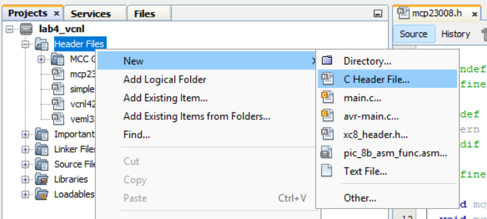
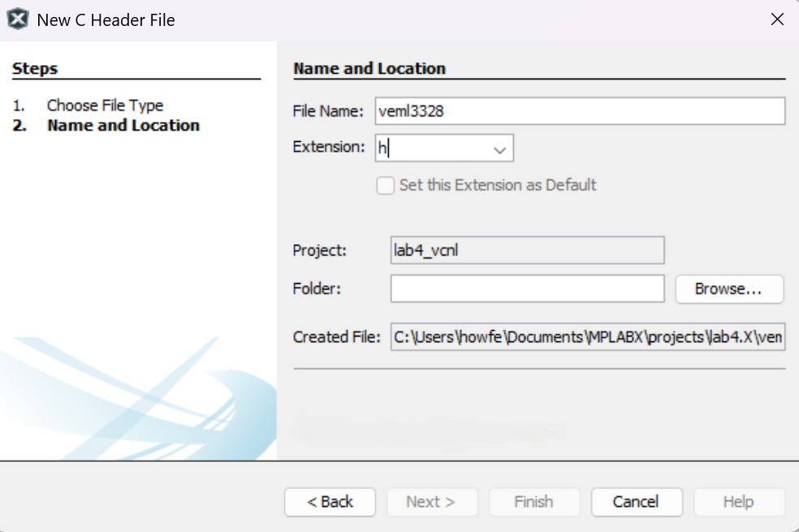
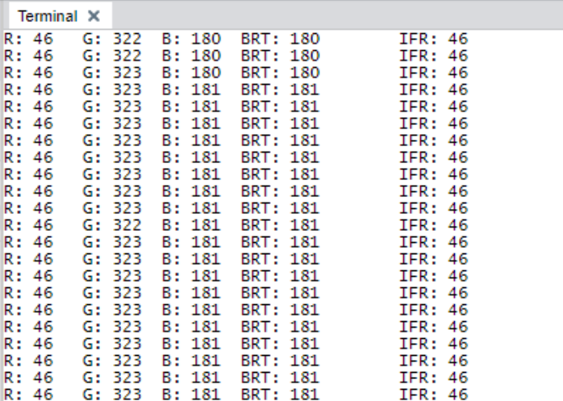

## Programming the VEML3328 and VCNL4200
This section will walk through the programming section of the lab. The project can be found in <PUT_PATH_HERE> in the project files.

### Writing the VEML3328 Driver
1. In the Projects tab, right click on Header Files then click New 🠖 C Header File.



2. In the File Name field, type “veml3328”. Leave all other fields as default. Then click Finish to create the header file.



3. In the veml3328.h file, add the following function declarations. The header file will be used by main.c to reference functions from other files we will be writing. The first #ifndef and #define directives at the top of the file are used by the compiler to identify the file.

```c
#ifndef VEML3328_H
#define VEML3328_H

#ifdef __cplusplus
extern "C" {
#endif

void veml_init();
void veml_read_colors(uint16_t* color);
void veml_read_brightness(uint16_t* brightness);

#ifdef __cplusplus
}
#endif

#endif /* VEML3328_H */
```

4. In the Projects tab, right click on Source Files then click on New 🠖 main.c. In the File Name field, type “veml3328”. Leave all other fields as default. Then click Finish to create the header file.

5. In the veml3328.c file, we will define the veml3328 peripheral address and important command codes from the [veml3328 datasheet](https://www.vishay.com/docs/84968/veml3328.pdf). We also define an array to store data from the veml3328.

```c
#include "mcc_generated_files/system/system.h"
#include <xc.h>

#define VEML_I2C_ADDR 0x10
#define VEML_CLR_CMD_REG 0x04
#define VEML_RED_CMD_REG 0x05
#define VEML_GRN_CMD_REG 0x06
#define VEML_BLU_CMD_REG 0x07
#define VEML_IFR_CMD_REG 0X08

static uint8_t read_data[2] = { 0x00, 0x00 };
```

6. Implement the following functions from the veml3328 header file:

- Creates a 3 element array initialized with all zeroes, then sends the array data to the veml3328 through I2C.

```c
void veml_init()
{
	static uint8_t write_data[3] = { 0x00, 0x00, 0x00 };
	while(TWI0_IsBusy());
	TWI0_Write(VEML_I2C_ADDR, write_data, 3);
}
```

- Sends the red command value to the veml3328 and reads the incoming 16-bit number into a 2 element 8-bit array called read_data. The value is transformed into a 16-bit number using bit shifting and stored into the provided array. The same process is repeated with the blue and green commands. The function writes the color data into the color array using the format: { red, green, blue }.

```c
void veml_read_colors(uint16_t* color)
{
	static uint8_t write_cmd;

	write_cmd = VEML_RED_CMD_REG;
	while(TWI0_IsBusy());
	TWI0_WriteRead(VEML_I2C_ADDR, &write_cmd, 1, read_data, 2);
	color[0] = (read_data[1] << 8) | read_data[0];

	write_cmd = VEML_GRN_CMD_REG;
	while(TWI0_IsBusy());
	TWI0_WriteRead(VEML_I2C_ADDR, &write_cmd, 1, read_data, 2);
	color[1] = (read_data[1] << 8) | read_data[0];

	write_cmd = VEML_BLU_CMD_REG;
	while(TWI0_IsBusy());
	TWI0_WriteRead(VEML_I2C_ADDR, &write_cmd, 1, read_data, 2);
	color[2] = (read_data[1] << 8) | read_data[0];
}
```

- Sends the clear (overall brightness) command to the veml3328 and reads in the data similar to the veml_read_colors() function. This function writes the brightness data into the brightness array in the format { brightness, infrared }.

```c
void veml_read_brightness(uint16_t* brightness)
{
	static uint8_t write_cmd;
    
	write_cmd = VEML_CLR_CMD_REG;
	while(TWI0_IsBusy());
	TWI0_WriteRead(VEML_I2C_ADDR, &write_cmd, 1, read_data, 2);
	brightness[0] = (read_data[1] << 8) | read_data[0];
    
	write_cmd = VEML_IFR_CMD_REG;
	while(TWI0_IsBusy());
	TWI0_WriteRead(VEML_I2C_ADDR, &write_cmd, 1, read_data, 2);
	brightness[1] = (read_data[1] << 8) | read_data[0];
}
```

### Writing the VCNL4200 Driver
7. In the Projects tab, right click on Header Files then click New 🠖 C Header File. In the File Name field, type “vcnl4200”. Leave all other fields as default. Then click Finish to create the header file. In the vcnl4200.h file, add the following function declarations.

```c
#ifndef VCNL4200_H
#define VCNL4200_H

#ifdef __cplusplus
extern "C" {
#endif

void vcnl_init();
uint16_t vncl_read_ps();

#ifdef __cplusplus
}
#endif

#endif /* VCNL4200_H */
```

8. In the Projects tab, right click on Source Files then click on New 🠖 main.c. In the File Name field, type “vcnl4200”. Leave all other fields as default. Then click Finish to create the header file.

9. In the vcnl4200.c file, we will define the vcnl4200 peripheral address and important command codes from the [vcnl4200 datasheet](https://www.vishay.com/docs/84430/vcnl4200.pdf). We also define an array to store data from the vcnl4200.

```c
#include "mcc_generated_files/system/system.h"
#include <xc.h>

#define VNCL_I2C_ADDR 0x51
#define VNCL_PS_CONF1_CONF2_REG 0x03
#define VNCL_DATA_PS_REG 0x08

static uint8_t read_data[2] = { 0x00, 0x00 };
```

10. Implement the following functions from the vcnl4200 header file:

- Creates a 3 element array with the proximity sensor configuration command, integration time, and PS_CONF2 register defaults. 0x06 sets the proximity sensor to use 4T integration time.

```c
void vcnl_init()
{
	static uint8_t write_data[3] = { VNCL_PS_CONF1_CONF2_REG, 0x06, 0x00};
	while(TWI0_IsBusy());
	TWI0_Write(VNCL_I2C_ADDR, write_data, 3);
}
```

- Requests data from the vcnl4200 using the proximity sensor data command and receives the 16-bit value as an array of 2 8-bit values. The resulting data is bit shifted into a 16-bit value and returned.

```c
uint16_t vncl_read_ps()
{
	static uint8_t write_cmd = VNCL_DATA_PS_REG;

	while(TWI0_IsBusy());
	TWI0_WriteRead(VNCL_I2C_ADDR, &write_cmd, 1, read_data, 2);
	return (read_data[1] << 8) | read_data[0];
}
```

### Writing the MCP23008 Driver
11. In the Projects tab, right click on Header Files then click New 🠖 C Header File. In the File Name field, type “mcp23008”. Leave all other fields as default. Then click Finish to create the header file.

12. In the vcnl4200.h file, add the following function declarations. The MCP_LED_CHUNK_SIZE macro is used to define the size for mapping the VCNL4200’s proximity value to the MCP23008 LEDs.

```c
#ifndef MCP23008_H
#define MCP23008_H

#ifdef __cplusplus
extern "C" {
#endif

#define MCP_LED_CHUNK_SIZE 512UL

void mcp_leds_init();
void mcp_write_leds(uint8_t val);

#ifdef __cplusplus
}
#endif

#endif /* MCP23008_H */
```

13. In the Projects tab, right click on Source Files then click on New 🠖 main.c. In the File Name field, type “mcp23008”. Leave all other fields as default. Then click Finish to create the header file. In the mcp23008.c file, we will define the mcp23008 peripheral address and the LED command register value.

```c
#include "mcc_generated_files/system/system.h"
#include <xc.h>

#define MCP_LEDS_ADDR 0x25
#define MCP_LEDS_IO_REG 0x09
```

14. Implement the following functions from the mcp23008 header file:

- Sets the direction of all LEDs to OUTPUT on the MCP23008.

```c
void mcp_leds_init()
{
	static uint8_t write_data[2] = { 0x00, 0x00 };
	while(TWI0_IsBusy());
	TWI0_Write(MCP_LEDS_ADDR, write_data, 2);
}
```

- Takes the following 8-bit value and turns on LEDs for 1 bits and turns off LEDs for 0 bits. The input is inverted using a bitwise NOT to compensate for the active low state of the MCP23008.

```c
void mcp_write_leds(uint8_t val)
{
	static uint8_t write_data[2] = { MCP_LEDS_IO_REG, 0x00 };
	write_data[1] = ~val;
	while(TWI0_IsBusy());
	TWI0_Write(MCP_LEDS_ADDR, write_data, 2);
}
```

### Writing the Timer Driver
We will need to write a timer driver to utilize simple delays in our code.

15. In the Projects tab, right click on Header Files then click New 🠖 C Header File. In the File Name field, type “systimer”. Leave all other fields as default. Then click Finish to create the header file. In the systimer.h file, add the following function declarations.

```c
#ifndef SYSTIMER_H
#define SYSTIMER_H

#ifdef __cplusplus
extern "C" {
#endif
    
void timer_callback();
void clear_timer();
uint32_t read_timer();

#ifdef __cplusplus
}
#endif

#endif /* SYSTIMER_H */
```

16. In the systimer.c file, implement the following functions from the systimer header file.

```c
#include "mcc_generated_files/system/system.h"
#include <xc.h>

static volatile uint32_t timer = 0UL;

void timer_callback()
{
	cli();
	timer++;
	sei();
}

void clear_timer()
{
	cli();
	timer = 0;
	sei();
}

uint32_t read_timer()
{
	uint32_t val;
	cli();
	val = timer;
	sei();
	return val;
}
```

### Writing Main.c

17. In main.c, we need to include the MCP23008, VEML3328, and VCNL4200 drivers as well as libraries for the UART_WriteString function.

- The proximity threshold is an arbitrary value used to determine the minimum proximity in order for the LEDs to light up.

```c
#include "mcc_generated_files/system/system.h"
#include <string.h>
#include <stdio.h>
#include "systimer.h"
#include "vcnl4200.h"
#include "mcp23008.h"
#include "veml3328.h"

#define PROXIMITY_THRESHOLD 100
void UART_WriteString(const char *message);
char uart_str[80];
```

18. In the main function, add the following code:

```c
int main(void)
{
	SYSTEM_Initialize();
	Timer0.TimeoutCallbackRegister(timer_callback);
	vcnl_init();
	mcp_leds_init();
	veml_init();

	UART_WriteString("MPLAB X Lab 4\n\r");
	clear_timer();
	while(read_timer() < 100);
    
	uint16_t proximity = 0;
	uint8_t led = 0, write_led = 0, i;
	uint16_t color[3] = { 0x00, 0x00, 0x00 };
	uint16_t light[2] = { 0x00, 0x00 };
    
	while(1)
	{
        proximity = vncl_read_ps();
        led = (uint8_t) (proximity / MCP_LED_CHUNK_SIZE);

        write_led = proximity > PROXIMITY_THRESHOLD ? 0x80 : 0x00;
        for (i = 0; i < led; i++)
        {
            write_led >>= 1;
            write_led |= 0x80;
        }
        mcp_write_leds(write_led);

        if (read_timer() > 100)
        {
            clear_timer();
            veml_read_colors(color);
            veml_read_brightness(light);
            sprintf(uart_str, "R: %u\tG: %u\tB: %u\tBRT: %u\tIFR: %u\n\r", color[0], color[1], color[2], light[0], light[1]);
            UART_WriteString(uart_str);
        }
	}
}
```

- Initializes the VCNL4200, MCP23008, and VEML3328 drivers, then uses a 100ms delay to wait for the peripherals to initialize. We also initialize a few variables to use in the while loop.
- In the while loop, we read in the proximity and calculate a LED value from the proximity, which is used to generate an 8-bit number to write to the MCP3008 LEDs. The PROXIMITY_THRESHOLD macro can be adjusted to increase or decrease the distance at which the LED activates.
- Every 100 milliseconds, we read the data coming from the VEML3328 and print it to the UART.

### Running the Lab

19. Press the build button  to compile and build the program. Then, navigate to the top toolbar and click Window 🠖 Debugging 🠖 Data Visualizer.


20. For the Curiosity Nano port, change the baudrate to 115200 if it isn’t set already, then click on the terminal icon to connect the port to the terminal.

21. Click the debug button  to start the project. The terminal output should start printing out the red, green, blue, brightness, and infrared values. When you move your hand close to the proximity sensor, you should see the LEDs on the MCP23008 light up!

