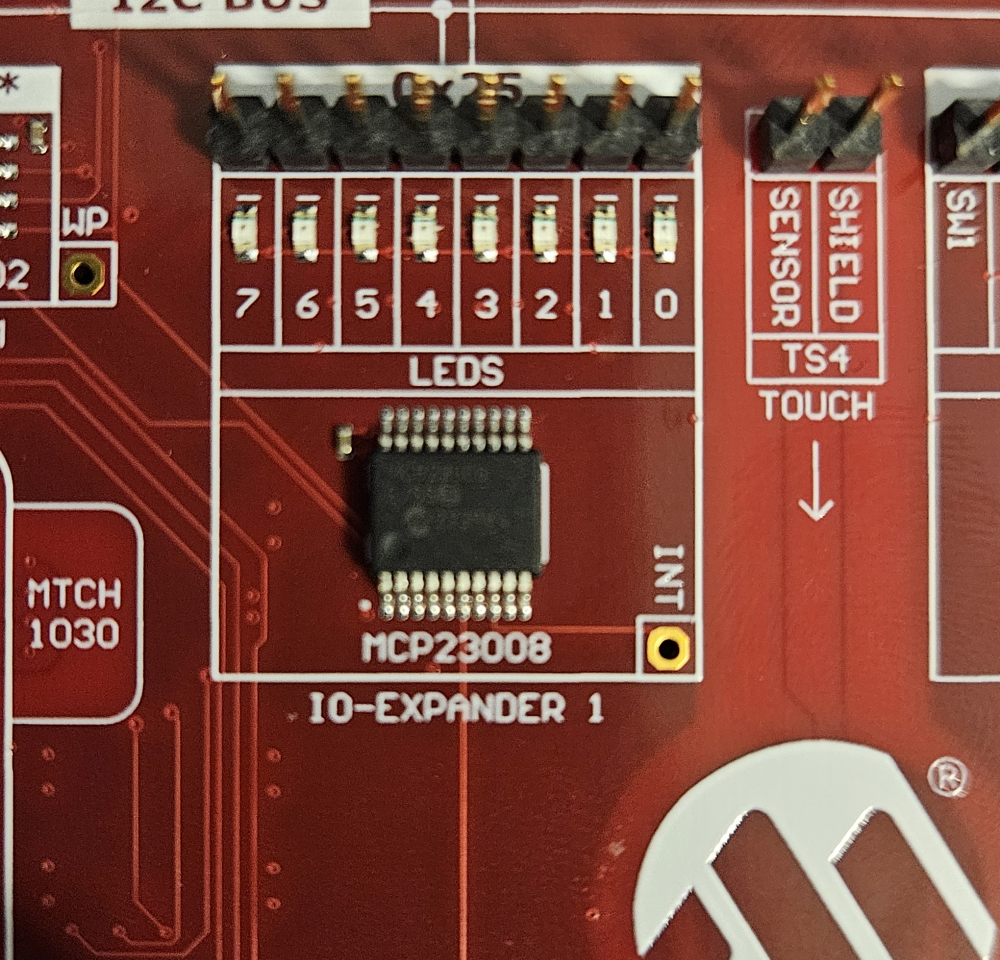
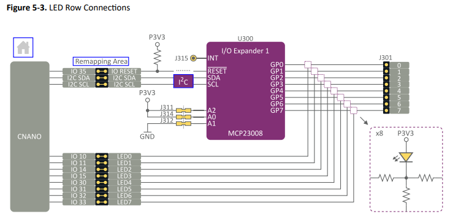
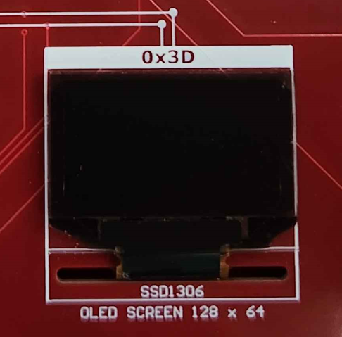
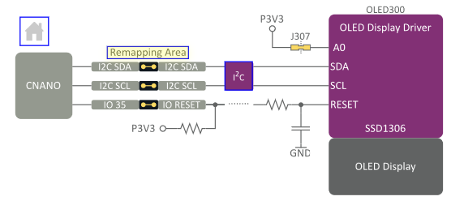
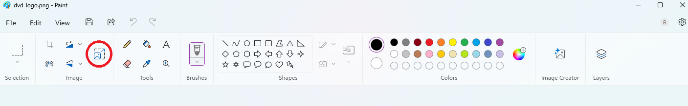
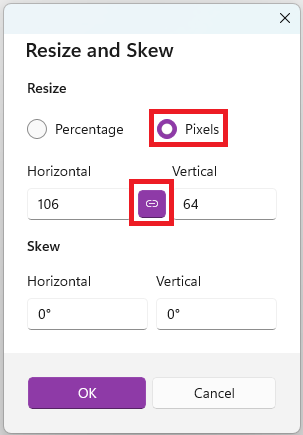
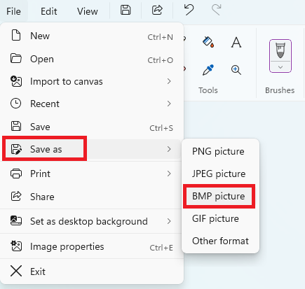
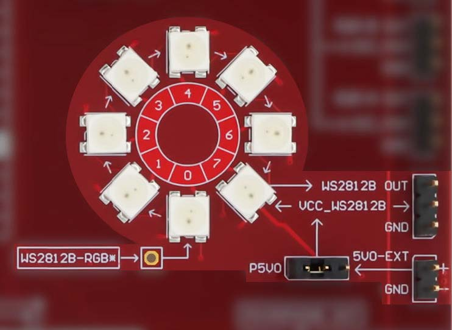

## Intro to Curiosity Nano Explorer board

The Curiosity Nano Explorer Board is a versatile development platform designed for rapid prototyping and learning. It supports all Curiosity Nano boards and features a variety of onboard components, making it easier for users to learn how to control microcontrollers and interface them with sensors, peripherals, and output devices. This board is ideal for students, hobbyists, and developers seeking hands-on experience in embedded systems and IoT applications.

The Explorer Board offers the following key features:

* Remappable Pinout: Allows flexible configuration of pin assignments to adapt to various project requirements.

* On-Board Peripherals:

  * Communication: USB-to-UART/I2C bridge and I2C I/O expanders for reliable data transmission.
  * Power Management: Includes a power monitor, voltage references, and power switches to     manage and monitor power usage efficiently.
  * Sensors: Features a temperature sensor, microphone, touch controller, and light sensor for environmental data collection and interaction.
* Output Devices:

  * Equipped with LEDs, an OLED display, a speaker, digital-to-analog converters, and servomotor drivers, allowing users to create interactive outputs.
* Connectivity Options:

  * Offers Grove I2C, mikroBUS, Qwiic I2C connectors, and a MicroSD card slot, providing flexibility in connectivity for external devices and modules.
* Power Supply:

  * Powered via an onboard USB Type-C connector, with external power options and various power management ICs to support diverse power requirements.
In this lab, we will explore the setup of the Explorer Board and learn how to use I2C to control LEDs, NeoPixels, and an LCD screen, building a foundation for understanding microcontroller-based systems.

## Setting up and working with the explorer Board

Setting up your Curiosity Nano Explorer Board is a straightforward process.

1. Installing the Curiosity Nano:

   * Align the Boards: Place your Curiosity Nano board at the top of the Explorer Board, ensuring the USB connector faces the top edge.
   * Align the Pins: Align the pins of the Curiosity Nano with the topmost female header pins on the Explorer Board.
   * Secure the Connection: Gently push the Curiosity Nano onto the header pins to establish a secure connection.
   

2. Understanding the Pin Connections:
   * Peripheral Connections: The Explorer Board connects the Curiosity Nano's pins to various peripherals. Refer to the markings on either side of the female header pins to identify these connections.
   * Pin Jumpers: The pin jumpers link peripherals to the Curiosity Nano.
   
3. Remapping Pins
If you need to use a peripheral that doesn't have a direct connection to your Curiosity Nano, you can remap pins:
   * Disconnect the Jumper: Remove the pin jumper from the peripheral you want to remap.
   * Connect the Wire: Use a jumper wire to connect the desired pin on the Curiosity Nano to the corresponding pin on the peripheral.
   

## Installing needed Libraries

The Arduino IDE utilizes libraries that simplify working with specific chips and components. For this lab, we’ll use libraries provided by Adafruit. Follow these steps to install them:

1. Open the Arduino IDE.
2. On the left-hand side, click the icon that resembles a set of books (library manager icon), as shown in the image below.
   
3. In the search bar, type "Adafruit GFX". Locate the library named "Adafruit GFX Library" and click Install (see image below).
   
4. Click Install All when prompted.
5. Next, search for "Adafruit SSD1306" and install the library labeled "Adafruit SSD1306", as shown in the image.
   
6. Again, click Install All when prompted.
7. Finally, search for "Adafruit MCP23008" and install the "Adafruit MCP23008 Library" as shown.
   
8. Click Install All to complete the installation process.

These libraries will support the components we’ll use in the lab, enabling smoother control over displays, sensors, and other connected devices.

## Working with the Amber LEDs

The MCP23008, or the "Amber LEDs", are a set of 8 LEDs located near the Microchip logo at the bottom of the Curiosity Explorer Board. These 8 LEDs 
will be used for learning our basics of communicating to the on-board components. 



The MCP23008 is connected to the Curiosity Nano in a few different ways. The primary connections are the I2C-SDA and I2C-SCL, which are used to communicate over the I2C bus connected to the IO-Expander 1. Note, the I2C address for the IO-Expander, which we will use in code later, is located at the top of the location where the LEDs are on the board (in this case being 0x25). 



To test this component, we will be creating a small sketch that "bounces" a light from one side of the LEDs to the other. Our goal will be to have the left-most LED start as on, then turn off, an the one right of it to turn on, repeating this until it reaches the other side, and then turning around and doing the opposite (right turns on, then off, one left of it turn and so on). 

To start our sketch, we will import a few basic libaries that will allow us to easily communicate to the IO-Expander 1. 

```
#include <SPI.h>
#include <Wire.h>
#include "Adafruit_MCP23008.h"
```

Here, we are getting the basic libraries for communication over I2C, and the specific Adafruit library for communicating to the MCP23008.

```
Adafruit_MCP23008 mcp_leds;
```

Next, outside of our setup or loop functions, we will create a variable to hold the reference to our LEDs. This holds the necessary methods we need to interact with the LEDs. 

```
void setup() {
  uint8_t pin_id, status;

  status = mcp_leds.begin(0x25);

  for (pin_id = 0; pin_id < 8; pin_id++) {
    mcp_leds.pinMode(pin_id, OUTPUT);
    mcp_leds.digitalWrite(pin_id, HIGH);
  }
}
```

Inside of our setup function, we define a variable for pin_id, which we use to iterate through our available pins, and a status variable to store the result of starting our mcp_leds. Note, we are using the address (0x25) that we noted earlier to instantiate the connection. While we aren't doing anything with this variable in this code, it can be used to debug later if neccessary. 

Now, instead of putting all of our code into our loop function, since it might be a bit long, we will create a separate method for it

```

void loop() {
  cylon();
}

void cylon(void) {
  static uint8_t led_index = 0, led_state = false, led_dir = true;
  static unsigned long cylon_timer = 0UL;
  unsigned long now;

  now = millis();
  if (now - cylon_timer > 37UL) {
    cylon_timer = now;
    if (led_state) {
      led_state = false;
      mcp_leds.digitalWrite(led_index, HIGH);
    } else {
      led_state = true;
      mcp_leds.digitalWrite(led_index, LOW);
    }

    if (led_state == false) {
      if (led_dir) {
        led_index++;
        if (led_index > 7) {
          led_index = 7;
          led_dir = false;
        }
      } else {
        led_index--;
        if (led_index > 127)  // unsigned 8 bit gone negative
        {
          led_index = 0;
          led_dir = true;
        }
      }
    }
  }
}
```

This is quite a large method! But the functionality of it is actually quite simple. Initially, we start by instantiating our necessary variables, those being:
- led_index - An unsigned integer representing which LED we are currently looking at
- led_state - An unsigned integer (though used as a boolean) representing if the LED is on or off
- led_dir - An unsigned integer representing the direction that the lights are travelling (left to right or right to left), also treated as a boolean
- cylon_timer - An unsigned long representing the time since we last updated the LEDs 

Note that all of these variables are marked with the `static` keyword, which will ensure that their values are kept between calls to our "loop" method. 

And finally, 

- now - An unsigned long representing the current time

Now we have all the necessary values we need to determine how to manipulate the LEDs to match our pattern of bouncing back and forth. 
```
    if (led_state) {
      led_state = false;
      mcp_leds.digitalWrite(led_index, HIGH);
    } else {
      led_state = true;
      mcp_leds.digitalWrite(led_index, LOW);
    }
```

Our first if statement is what turns on or off our LED at this location, if it is on, it is turned off, and if it is off it is turned on. This is done through the "digitalWrite" method on the mcp_leds instance we made earlier, and the led_index we created at the start of this method. Note again that the Curiosity Nano Explorer is low-activated, meaning that `mcp_leds.digitalWrite(led_index, LOW);` turns the LED on. 

```
if (led_state == false) {
      if (led_dir) {
        led_index++;
        if (led_index > 7) {
          led_index = 7;
          led_dir = false;
        }
      } else {
        led_index--;
        if (led_index > 127)  // unsigned 8 bit gone negative
        {
          led_index = 0;
          led_dir = true;
        }
      }
    }
```

In this if statement (note this is AFTER we have changed the led_state in the first if statement) we increment (or decrement) the current led_index based on the led_dir. Additionally, we check if we have reached the end of the LEDs (led_index > 7 for example), and change direction as necessary. 

And that's it! We now have a working program for bouncing an LED from one side to the other of the Amber LEDs, and an understanding of using the Adafruit library for the MCP23008. 

## Working with the OLED Display

The SSD1306 is a OLED display located towards the bottom right of the Curiosity Explorer Board. The display functions as a digital screen, with the capability to draw pixels in a 128-pixels wide by 64-pixels high grid. The display does not support color, meaning pixels can only be ON or OFF.



The SSD1306 is connected to the I2C-SDA and I2C-SCL hookups. The SDA is used for data transfer while the SCL is used to synchronize communication. These pins are already adjacent to the PA2 and PA3 pins on the Curiosity Nano, so there is no remapping required.



Working with the SSD1306 requires the Adafruit GFX and SSD1306 libraries, along with their dependency libraries:

```
#include <SPI.h>
#include <Wire.h>
#include <Adafruit_GFX.h>
#include <Adafruit_SSD1306.h>
```

To interact with the display, we need to create an instance of the `Adafruit_SSD1306` library with a few values:

```
#define SCREEN_WIDTH 128      // OLED display width, in pixels
#define SCREEN_HEIGHT 64      // OLED display height, in pixels
#define OLED_RESET -1         // Reset pin, set to -1 to share Arduino reset pin
#define SCREEN_ADDRESS 0x3D   // 7-bit I2C Address, see CNANO-Explorer User Guide 6.3.7

Adafruit_SSD1306 display(SCREEN_WIDTH, SCREEN_HEIGHT, &Wire, OLED_RESET);
```

We now have a global variable named `display`. Then, in the `setup()` function, we need to add the following code to ready up the display:

```
void setup() {
  delay(1000); // Wait for the display to ready

  if (!display.begin(SSD1306_SWITCHCAPVCC, SCREEN_ADDRESS)) {
    for(;;); // Display not connected or malfunctioning, loop forever
  }

  // ...
}
```

This allows us to use the library's functions to draw pixels on the screen. The origin point (x=0, y=0) is located at the top left of the screen, as pixels are draw left to right, up to down. Since the SSD1306 does not support color, all color values will always be 1 (white) or 0 (black). The library includes functions for drawing<sup>1</sup><sup>2</sup>, most notably:

- clearDisplay() - Clears the screen of all active pixels.
- drawPixel() - Draws a single pixel at the given position
- drawLine() - Draws a line between two given positions on the screen.
- drawRect() - Draws a rectangle of a given width and height from a given screen position. Use fillRect() to draw a filled in rectangle.
- drawCircle() - Draws a circle of a given radius from a given screen position. Use fillCircle() to draw a filled in circle.
- drawTriangle() - Draws a triangle from 3 given positions. Use fillTriangle() to draw a filled in triangle.
- drawChar() - Prints a character at a given position of a given size.
- drawBitmap() - draws a 2D image using a given character array with a given width and height at a given position.

<sup>1</sup>Drawing methods can be found in the Adafruit_GFX.h file in the repository: https://github.com/adafruit/Adafruit-GFX-Library/

<sup>2</sup>Basic methods can be found in the Adafruit_SSD1306.h file in the repository: https://github.com/adafruit/Adafruit_SSD1306/

The OLED display will display the Adafruit logo by default, we need to call `clearDisplay()` to clear it off before doing any draw operations:

```
  display.clearDisplay(); // clear the Adafruit logo
```

When drawing on the SSD1306, calling draw functions will not automatically show up on the display. To fix this, we need to follow up draw function with `display()`.

```
  display.fillRect(0, 0, 40, 20, 1);  // Draws a 40px by 20px rectangle at (0,0)
  display.drawPixel(80, 40, 1);       // Draws a pixel at (80, 40)
  display.drawCircle(80, 40, 20, 1);  // Draws a circle with 20px radius at (80, 40)
  display.drawChar(20, 40, 'A', 1, 0, 2); // Draws 'A' of size 2 at (20,40)

  display.display(); // Display draw operations on screen
```

Note: Calling `display()` multiple times will not visibly do anything, unless additional draw operations are used.

This generates the following visual on the OLED display. In the next section, you will learn how to display an image on the OLED display using `drawBitmap()`.


#### Displaying an Image

1. Open Arduino IDE and create a new sketch with the following code:

```
#include <SPI.h>
#include <Wire.h>
#include <Adafruit_GFX.h>
#include <Adafruit_SSD1306.h>

#define SCREEN_WIDTH 128
#define SCREEN_HEIGHT 64
#define OLED_RESET -1
#define SCREEN_ADDRESS 0x3D

Adafruit_SSD1306 display(SCREEN_WIDTH, SCREEN_HEIGHT, &Wire, OLED_RESET);

void setup() {
  delay(1000);
  if (!display.begin(SSD1306_SWITCHCAPVCC, SCREEN_ADDRESS)) {
    for(;;);
  }
}

void loop() {

}
```

2. Install the Adafruit SSD1306 library from the library manager tab. Ensure that the Adafruit GFX library and its dependencies are installed as well.

Arduino cannot read the formatting nor handle the size of regular images, so the image will need to be converted to a bitmap image (.BMP) and shrunk to a small enough size to fit on the screen.

3. Go to your start menu by pressing the Windows key and Open Microsoft Paint.

4. On the top left corner, go to File -> Open, this should open up a File Explorer window. Select an image of your choosing then click "Open".

5. Towards the top of the screen, in the "Image" menu section click on the "Resize and Skew" option. On older versions of Microsoft Paint, it may be called "Resize". Alternatively, the shortcut Ctrl+W can be used to access this menu.



6. Change the "Resize" option to Pixels. Then modify either width or height such that the width is equal or less than 128 pixels and the height is equal or less than 64 pixels. This is because the SSD1306 is limited to 128 pixels by 64 pixels. It is recommended to select "Maintain Aspect Ratio" so that the image does not look distorted.



7. Once done, select "OK" to render the size changes.

8. Then, on the top left, go to File -> Save As -> BMP picture, this should open up a File Explorer window. Select an appropriate directory to save to and select Save.



9. Go to https://javl.github.io/image2cpp. Under "Select Image", upload the BMP image that was exported in the previous step. Canvas Size under Image Settings should be the same dimensions as the image.

10. Scroll to the bottom and change Code Output Format to "Arduino code, single bitmap". Then, click on Generate Code. This should generate a code snippet<sup>3</sup>. Copy and paste this code snippet into the sketch before the `setup()` function.

<sup>3</sup>`PROGMEM` tells the micro-controller to store the variable in flash memory instead of in program memory. This is usually applied to variables that do not change at all during a program's execution and take up a notable amount of memory.

11. Directly after the image array, define width and height constants to store the dimensions of the image. This will be used to tell the library how tall and wide our image is.

```
#define IMAGE_WIDTH <your image width in pixels>
#define IMAGE_HEIGHT <your image height in pixels>
```

12. In the `setup()` function, call `drawBitmap()` after the display has been initialized. We will draw the image from the top left corner so that no part of the image is cut off. 

```
void setup() {
  drawBitmap(0, 0, <name of image array>, IMAGE_WIDTH, IMAGE_HEIGHT, 1)
}
```

13. Select the port and board then compile the sketch, ensuring that Tools -> Chip is set to "AVR64DD32 and Tools -> Programmer is set to "Curiosity Nano". Use Sketch -> Upload Using Programmer to send the code to your Curiosity Explorer.

14. You should now see an image show up on the SSD1306 display. If the image does not show up, check that your Curiosity Nano is properly connected to the Curiosity Explorer board.

The SSD1306 OLED display is a very versatile peripheral that can be used to display graphics. For a more advanced example, check out the [ssd1306_bouncing_logo](./Code/OLED_code/ssd1306_bouncing_logo.ino) sketch that displays a bouncing logo.

## Working with the Digital Addressable LEDs

The Explorer features eight serially addressable RGB LEDs.
They are mapped to pin PC3 on the Curiosity Nano Evaluation Kit.



#### Animate a Multicolored LED Ring Chase

Copy and paste this code into a new sketch. The directive ```#include <tinyNeoPixel.h>``` adds support for controlling 
```NeoPixel (WS2812)``` LEDs.

```
#include <tinyNeoPixel.h>

tinyNeoPixel pixel_ring = tinyNeoPixel(8, PIN_PC3, NEO_GRB + NEO_KHZ800);
unsigned long color_grid[3] = {0x00007f,0x007f00,0x7f0000};

void setup() {
  pixel_ring.begin();
}

void loop() {
  static unsigned long ring_timer = 0UL;
  unsigned long now;
  static uint8_t pixel_index = 0,color_index = 0;

  now = millis();
  if(now - ring_timer > 211UL)
  {
    ring_timer = now;
    pixel_ring.clear();
    pixel_ring.show();    
    pixel_ring.setPixelColor(pixel_index,color_grid[color_index]);
    pixel_ring.show();
    pixel_index++;
    if(pixel_index > 7)
            pixel_index = 0;
    color_index++;
    if(color_index >= 3)
      color_index = 0;
  }
}
```

The ```loop``` function shifts both the active LED and its color after 211 milliseconds, cycling through each LED in the ring 
and the colors in ```color_grid```.

For additional animations, check out the example sketches at ```File -> Examples -> tinyNeoPixel.``` 
Be sure to open **strandtest** and **RGBWstrandtest** to see some dynamic lighting effects.

Please note that these sketches may require the correct pin configuration and LED count to function as intended.
In this case, use the following settings:

```
#define PIN PIN_PC3
#define NUM_LEDS 8
```
