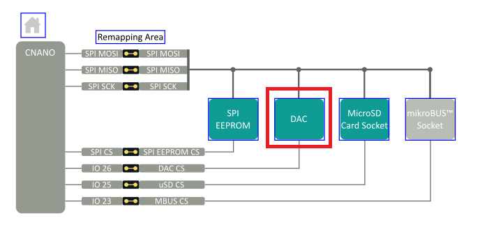
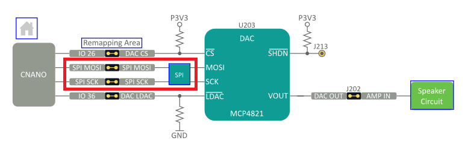

# DAC MCP4821
This program relies on the [MCP_DAC library](https://github.com/RobTillaart/MCP_DAC) made by Rob Tillaart. This program plays a series of notes of different lengths and goes back and forth between predetermined notes frequencies and lengths. The MCP4821 is a 12bit digital-to-analog controller that relies on the Curiosity Explorer's SPI (Serial Peripheral Interface) Bus to send data to the DAC. The MCP4821 operates a maximum of 20MHz (20 millions times a second). 

## SPI

Serial Peripheral Interface is a moderately old component management architecture where the controller (formerly "master) sends signals to manage multiple peripherals (formerly "slaves")



Acronyms:
- SPI MOSI: Master Out Slave In (now COPI), is used for the main controller to send data to the peripherals
- SPI MISO: Master In Slave Out (now PICO), is used for the peripherals to send data to the controller
- SPI SCK: Serial Clock Line, is used to trigger data communication cycles to send or receive data

There are a total of 4 SPI components on the Curiosity Nano, so altering the Chip Select (formerly "Slave Select") is used to tell which component to send data to or read data from. Programs need to `digitalWrite` LOW to the Chip Select (CS) of the target peripheral to interact with that peripheral.



There is also the DAC LDAC, which is used to trigger sends to multiple SPI peripherals at once.

### Base Implementation

Under the hood, the MCP4821 library starts by writing the SPI_MOSI and SPI_SCK to LOW. The Chip Select (DAC_CS) is also written to as HIGH so that nothing is being written over yet.
```
#define SPI_MOSI 4  // PA4
#define SPI_SCK 6   // PA6
#define DAC_LDAC 22 // PF2, remapped SW1
#define DAC_CS 10 // PC2

void setup() {
  pinMode(DAC_CS, OUTPUT);
  digitalWrite(DAC_CS, HIGH);

  pinMode(SPI_MOSI, OUTPUT);
  pinMode(SPI_SCK, OUTPUT);
  digitalWrite(SPI_MOSI, LOW);
  digitalWrite(SPI_SCK, LOW);
}
```

Then, writing to the DAC starts with selecting the chip (`digitalWrite` LOW), then writing a series of HIGH and LOWs and alternating the SCK to communicate the data over. Finally, a HIGH value is written to the CS to "end the message."

```
void loop() {
  digitalWrite(DAC_CS, LOW);
  for (;;;) { // loop condition
    digitalWrite(SPI_MOSI, <LOW or HIGH>);
    digitalWrite(SPI_SCK, HIGH);
    digitalWrite(SPI_SCK, LOW);
  }
  digitalWrite(DAC_CS, HIGH);
}
```

### SPI Implementation

The SPI.h library abstracts a lot of the manual `digitalWrite` into a simple library. For example, for the MCP4821 in particular, the setup looks like this:
```
#include <SPI.h>

void setup() {
  SPI.begin();
}
```

Then, transferring values through the SPI library is also simple. However, the chip select needs to be done manually.
```
#define DAC_CS 10 // PC2

void loop() {
  SPI.beginTransaction(SPISettings(20000000, MSBFIRST, SPIMODE0));
  digitalWrite(DAC_CS, LOW);

  SPI.transfer(0xff);

  digitalWrite(DAC_CS, HIGH);
  SPI.endTransaction();
}
```

The `20000000` is the rate in Hertz (Hz) of the DAC, `MSBFIRST` is most significant byte first and means that binary values are passed in from left to right. `SPIMODE0` means that the operation occurs before the initial rising cycle of the clock.

**It is important to note that SPI comes with builtin values for SCK, MOSI, MISO that cannot be overridden, which is why it does not work for the Curiosity Explorer board in particular**