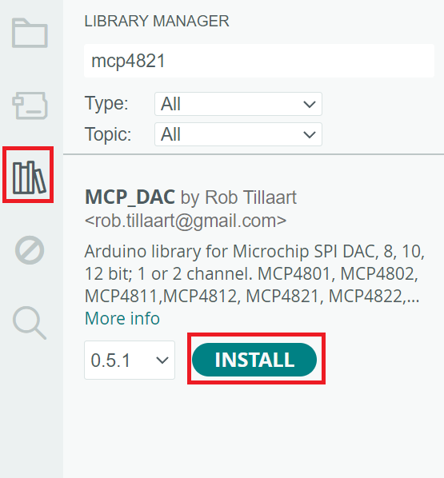

## UART (Universal Asynchronous Receiver-Transmitter)

UART is a communication protocol that enables serial data exchange between two devices without requiring a clock signal. It allows data to be sent and received asynchronously, meaning that data bits are transmitted sequentially over a single wire. This protocol is commonly used for serial communication with microcontrollers and computers.

In the Curiosity Nano, UART allows the board to connect with a computer through a serial communication interface. The Curiosity Nano has a built-in USB-to-UART converter that translates UART signals into USB signals. When the board is connected to a computer via USB, the computer sees it as a virtual COM port, enabling data transfer through serial communication tools like a terminal emulator. This setup allows you to send data to and receive data from the Curiosity Nano for debugging or data exchange.

## UART Code Example 1

    void setup() { 
      Serial.swap(3);
      Serial.begin(115200);
      Serial.println("Enter an expression (e.g., 5+3):");
    }
    
    void loop() {
      if (Serial.available() > 0) {
        String input = Serial.readStringUntil('\n');  // Read the input until newline
        float num1 = 0, num2 = 0;
        char op;
        bool operatorFound = false;
    
        // Parse the input
        int i = 0;
        while (i < input.length()) {
          char c = input[i];
    
          if (isdigit(c)) {
            if (!operatorFound) {
              num1 = num1 * 10 + (c - '0');
            } else {
              num2 = num2 * 10 + (c - '0');
            }
          } else {
            op = c;  // Store the operator
            operatorFound = true;
          }
          i++;
        }
    
        // Check if an operator was found and perform the calculation
        if (operatorFound) {
          switch (op) {
            case '+':
              Serial.println(num1 + num2);
              break;
            case '-':
              Serial.println(num1 - num2);
              break;
            case '':
              Serial.println(num1 num2);
              break;
            case '/':
              if (num2 != 0) {
                Serial.println(num1 / num2);
              } else {
                Serial.println("Error: Division by zero");
              }
              break;
            default:
              Serial.println("Invalid operator");
          }
        } else {
          Serial.println("Invalid expression format");
        }
      }
    }

## UART Code Example 2

    #define LED_Pin 25
    void setup() { 
      pinMode(LED_Pin, OUTPUT);
      Serial.swap(3);
      Serial.begin(115200);
      delay(100);
      Serial.println("Enter on or off.");
    }
    
    void loop() {
     if (Serial.available() > 0) {
        String input = Serial.readStringUntil('\n');  // Read the input until newline character
        input.trim(); // Remove any extra spaces or newline characters
    
        if (input.equalsIgnoreCase("on")) {  // Check if input is "on"
          digitalWrite(LED_Pin, LOW);       // Turn LED on
          Serial.println("LED is ON");
        } else if (input.equalsIgnoreCase("off")) {  // Check if input is "off"
          digitalWrite(LED_Pin, HIGH);        // Turn LED off
          Serial.println("LED is OFF");
        } else {
          Serial.println("Invalid input. Type 'on' or 'off'.");  // Handle invalid input
        }
      }
    }

## ADC (Analog-To-Digital) Converters

An Analog-To-Digital (ADC) converter is a tool that takes real world reading from a sensor (analog) and converts it into a value that can be understood by a program (digital). 
Generally speaking, analog data comes in through sensors or other peripherals, and is continuous in nature; This meaning that it is not set to certain breakpoint or restrictions like variables in code are, think things like voltage or temperature. In order to translate this continous data into digital data, 'breakpoints' are set in order to determine how to round the continous data to fit the digital version. In the below graph you can see an example of this, where value are simply rounded up or down depending on if the value is equal to the actual breakpoint. 

  
(from: [https://www.microcontrollerboard.com/analog-to-digital-converter.html](https://www.microcontrollerboard.com/analog-to-digital-converter.html))

In specific, we can look at the space between 011 and 100. Here, we see that the red line (representing digital) only ever increases after the blue line (representing analog) reaches the dashed line above it, even though the blue line is in between 011 and 100. While different Analog-To-Digital converters can interpret these breakpoints differently, especially depending on what is being digitized, the general idea of rounding based on breakpoints remains consistent. 

To further understand this concept, we will be using the on board potentiometer on the Curiosity Nano Explorer board, pictured below. 


### ADC Demonstration Sketch

In order to see how the board takes outside (analog) input and translates it into digital values, we will create a small sketch that will do two main things: read in analog input from the potentiometer and display it to see how it is digitized. 

To accomplish this, we will be using the AmberLEDs from the previous lab, as well as the UART to print the digitized value to the serial monitor. 

```
#define POTMETERPIN 19

#include <Wire.h>
#include "Adafruit_MCP23008.h"

Adafruit_MCP23008 mcp_leds;
```

Our first few lines define the very important components we will use to accomplish this, namely the POTMETERPIN (with value of 19, the identifier index found in pins_arduino.c for the Curiosity Nano board). We also have the familiar import for the AmberLED component (refer to lab 2 for further details).

```
void setup() {
  // put your setup code here, to run once:
  Serial.swap(3);
  Serial.begin(115200);

  uint8_t pin_id, status;

  status = mcp_leds.begin(0x25);

  for (pin_id = 0; pin_id < 8; pin_id++) {
    mcp_leds.pinMode(pin_id, OUTPUT);
    mcp_leds.digitalWrite(pin_id, HIGH);
  }
}
``` 

In our setup function, we do a further 2 important things, we:

- Initialize our UART serialization:

```
  Serial.swap(3);
  Serial.begin(115200);
```

and initialize our AmberLEDS

```
  uint8_t pin_id, status;

  status = mcp_leds.begin(0x25);

  for (pin_id = 0; pin_id < 8; pin_id++) {
    mcp_leds.pinMode(pin_id, OUTPUT);
    mcp_leds.digitalWrite(pin_id, HIGH);
  }
```

Next, our simple loop function: 

```
void loop() {
  // put your main code here, to run repeatedly:

  int readValue = analogRead(POTMETERPIN);
  int leds = 0;

  Serial.println("Potmeter value: " + String(readValue));

  while(readValue > 128) {
    readValue = readValue - 128; 
    leds++;
  }

  for(int i = 0; i < 8; i++){
    if(i <= leds){
      mcp_leds.digitalWrite(7-i, LOW);
    } else {
      mcp_leds.digitalWrite(7-i, HIGH);
    }
  }
}
```

Here, we do the main part of this lab, the line 

```
 int readValue = analogRead(POTMETERPIN);
```

Which will read in the analog input from the potentiometer, with a value of between 0 and 1024. As mentioned in the graph at the start of this section, the potentiometer includes and internal ADC that reads in these values and digitizes them, allowing us to use them as an integer value in this case in code. Note: since analog values are continous, the value maybe be somewhat inconsistent in what it reports, such as swapping between 1023 and 1024 at max value. 

```
  int leds = 0;

  Serial.println("Potmeter value: " + String(readValue));

  while(readValue > 128) {
    readValue = readValue - 128; 
    leds++;
  }

  for(int i = 0; i < 8; i++){
    if(i <= leds){
      mcp_leds.digitalWrite(7-i, LOW);
    } else {
      mcp_leds.digitalWrite(7-i, HIGH);
    }
  }
```

In the remaining portion of our loop function, we create a variable to hold how many LEDs to illuminate, and print the value read from the potentiometer to the UART serial monitor. Then, since we have 8 total LEDs, we repeatedly subtract 128 from the value we have read and add 1 LED to light up, until the value is less than 128. Finally, we loop through all 8 possible LEDs, and for however many we found for the "leds" variable, we set their value to LOW to turn them on, and turn the rest to HIGH to turn them off (especially important so they dont remain on when we go from a higher to lower value!) Additionally, we are using an index of `7-i` since the leftmost LED is considered at index 7, allowing it to grow left to right instead of right to left. 

And thats our basic demonstration of ADCs! They are a simple but very important tool for any microcontroller to interface with outside sensors and other analog signals.  

## Pulse Width Modulation

### What is Pulse Width Modulation?

**Digital vs. Analog Signals:**  
Digital signals are binary (0 or 1), while analog signals have a continuous range of values. To convert analog input into a digital format, we use an **Analog-to-Digital Converter (ADC)**.

**Controlling Analog Devices with Digital Signals:**  
  To control analog devices with a digital signal, a **Digital-to-Analog Converter (DAC)** is typically used to generate true analog signals.

**PWM as an Alternative to DAC:**  
  However, **Pulse Width Modulation (PWM)** offers a cost-effective alternative to a DAC by mimicking analog behavior with a digital signal. PWM can control devices like motors and lights, producing an analog-like signal instead of a true analog output.

**How PWM Works:**  
  PWM generates a variable output voltage by rapidly switching a pin between high and low states at a fixed **frequency**. The **duty cycle** (the percentage of time the pin is high) determines the average voltage output. By increasing or decreasing the relative on-time, the average voltage changes. This average voltage provides a lower power equivalent, while still maintaining full voltage during the pulse's on-state.

**Applications of PWM:**  
  PWM is widely used in various applications that require the control of power and brightness:
  - **Motor Speed Control:** Adjusting the speed of motors by controlling the average voltage delivered.
  - **LED Dimming:** Adjusting the brightness of LEDs by changing the duty cycle.
  - **Audio Synthesis:** Modulating audio signals for sound generation.

**Advantages of PWM:**  
  - **Cost-Effective:** PWM provides an inexpensive way to simulate analog control without requiring expensive DACs.
  - **Efficiency:** PWM can efficiently control power while reducing power losses, as full voltage is only used during 
the pulse’s on-state.

### What are the Key Parameters of PWM?

#### Frequency
Frequency measures how fast the signal is alternating between HIGH and LOW. It is measured in Hz.
Its inverse is the full period time interval. 

```
    Frequency = (1 / Period) Hz
```

#### Duty Cycle
The duty cycle is the fraction of time the signal is "high" versus "low". It is expressed
as a percentage. The duty cycle formula is as follows:

```
    Duty Cycle = (Time On Within Period) / (Period) * 100%
```

### PWM on the Curiosity Nano
The AVR64DD32 microcontroller provides hardware support for generating PWM signals through its 
internal timers. These signals are mapped to specific I/O pins that can output the PWM waveform when 
configured properly. The PWM functionality is provided by timers that are responsible for generating 
the pulse train.

It uses three primary timers—TCA, TCB, and TCD—to generate PWM signals. 
Each timer has different modes of operation, providing flexibility in how the PWM signals are generated.

The following pins on Curiosity Nano Evaluation Kit can be easily configured for generating PWM output:

- PIN_PD1
- PIN_PD2
- PIN_PD3

On the **Explorer Board**, you will find an RGB LED connected to those PWM outputs.
We will be utilizing it to evaluate the functionality of PWM generation.


### Pin Functionality

Generating PWM output on the Curiosity Nano requires a simple set up. If you want to use PD1 for PWM, 
you would configure Timer A (TCA0) to output PWM on Port D. 

This setup would involve:

1. Setting the correct PORTMUX[^1] register to route the PWM signal to Port D.
2. Configuring the TCA registers for the desired PWM frequency and duty cycle.[^2]

This bit field controls the pin positions for TCA0 signals.


The following line would ensure that the PWM signal generated by TCA0 is routed to PORTD,
where PD1, PD2, and PD3 are located, allowing them to function as PWM outputs.

```
PORTMUX.TCAROUTEA = PORTMUX_TCA0_PORTD_gc;
```

[^1] The PORTMUX (Port Multiplexer) is a feature in the AVR64DD32 microcontroller that allows you to
remap or reassign specific peripheral functions to different pins based on their available ports.

[^2] analogWrite() encapsulates this functionality. We will explore analogWrite() in the sample sketches.

### Sample Sketches 

#### Sketch 1: analogWrite

`analogWrite` simulates an analog signal by generating a Pulse Width Modulation (PWM) signal, where the perceived 
voltage is controlled by adjusting the duty cycle of the signal. For example, a 50% duty cycle (pin HIGH for half 
the time and LOW for the other half) simulates half the maximum voltage. If the pin is connected to a device like an 
LED or a motor, the rapid switching is perceived as a dimmer LED or a slower motor speed because of the averaging effect.

In Arduino, the `analogWrite` function is used to output a PWM signal to a specified pin with a certain duty cycle.

The graphic below illustrates how analogWrite() uses a value in the range of 0 to 255 to control the duty cycle. 


The following sketch demonstrates how to fade the brightness of the Explorer Board's RGB LED connected to pins **PD1**, 
**PD2**, and **PD3**, corresponding to red, green, and blue. Each color's brightness is adjusted one at a time, 
creating a fading effect. This sketch has been adapted for the **AVR64DD32** microcontroller from the original example 
found at: **File -> Examples -> 03.Analog -> AnalogWriteMega**.

1. Start by defining constants to hold the range of pins to control. By using `lowestPin` and `highestPin`, the program
can iterate through all three pins dynamically.

``` 
    const int lowestPin = PIN_PD1;
    const int highestPin = PIN_PD3;
``` 

2. Configure the microcontroller to route the TCA0 signal (Timer/Counter A) to PORTD, where the pins PD1, PD2, and PD3
are located.

``` 
    void setup() {
      // Re-route the signal generated by TCA0 to PORTD (which includes PD1, PD2, PD3)
      PORTMUX.TCAROUTEA = PORTMUX_TCA0_PORTD_gc;
    }
``` 

3. In an outer for loop, iterate over the selected pins to control them one at a time. 

``` 
    void loop() {
      // Iterate over the pins (Red -> Green -> Blue):
      for (int thisPin = lowestPin; thisPin <= highestPin; thisPin++) {
``` 

4. First, write an inner for loop to gradually increase the brightness of the current LED with a value from 0 to 255.   

``` 
        // Fade the LED on thisPin (Red, Green, or Blue) from off to brightest:
        for (int brightness = 0; brightness < 255; brightness++) {
          analogWrite(thisPin, brightness); // Adjust brightness for this pin
          delay(2); // Delay to control the fade speed
        }
``` 

5. Second, write another inner for loop to gradually decrease the brightness of the current LED with a value from 255 to 0.

``` 
        // Fade the LED on thisPin (Red, Green, or Blue) from brightest to off:
        for (int brightness = 255; brightness >= 0; brightness--) {
          analogWrite(thisPin, brightness); // Adjust brightness for this pin
          delay(2); // Delay to control the fade speed
        }
```
6. Pause for 100 milliseconds before fading the next color. Close the outer loop and the loop() function.  

```
        // Pause between color changes:
        delay(100);
      }
      
    }
```

#### Sketch 2: Potentiometer Dimming

This sketch allows you to adjust the brightness of the RGB LED using the potentiometer on the Curiosity Nano Explorer Board. 
It is based on the sample sketch located in **File -> Examples -> 03.Analog -> AnalogInOutSerial**, adapted for the AVR64DD32.
The sketch continuously reads the analog value from the potentiometer connected to PIN_PD7 using analogRead().
It uses the map() function to scale the unsigned 10-bit input value (0-1023) to an unsigned 8-bit value (0-255), which
corresponds to the PWM duty cycle for controlling the LED's brightness. 

For debugging purposes, the raw potentiometer value (`sensorValue`) and the mapped PWM output value (`outputValue`)
are printed to the Serial Monitor. This allows you to observe the changes in brightness as the potentiometer is adjusted.

1. Define `analogInPin` as `PIN_PD7` to read input from the potentiometer, and `analogOutPin` as `PIN_PD1` to control 
the red LED using PWM. Initialize `sensorValue` to store the potentiometer reading and `outputValue` to store the 
mapped PWM brightness value.

```
    const int analogInPin = PIN_PD7;  // Analog input pin where the potentiometer is connected
    const int analogOutPin = PIN_PD1;  // Analog output pin where the LED (RGB) is connected
    
    int sensorValue = 0;  // Variable to store the value read from the potentiometer
    int outputValue = 0;  // Variable to store the mapped PWM value for controlling LED brightness
```
2. In the setup() function, configure serial communication by swapping UART pins with Serial.swap(3) and starting 
communication at 115200 baud with Serial.begin(115200). Enable PWM output on Port D.

```
    void setup() {
      // Initialize serial communication at 115200 baud rate
      Serial.swap(3);  // Swap UART for serial communication
      Serial.begin(115200);  // Start serial communication
      
      // Set up the port multiplexer to route the PWM signal to Port D
      // This enables PWM output on pins PD1 to PD3
      PORTMUX.TCAROUTEA = PORTMUX_TCA0_PORTD_gc;
    }
```

3. In the loop() function, read the potentiometer value using analogRead(analogInPin) and map it from the range
0-1023 to 0-254 using map(). 

```
    void loop() {
      // Read the analog value from the potentiometer (range: 0 to 1023)
      sensorValue = analogRead(analogInPin);
      
      // Map the sensor value (0-1023) to the PWM range (0-254)
      // PWM has a range of 0-255, but 254 is used to avoid full duty cycle
      outputValue = map(sensorValue, 0, 1023, 0, 254);
```

4. Adjust the LED brightness by writing the mapped value to the output pin with analogWrite(analogOutPin, outputValue). 
Print the sensor and output values to the Serial Monitor for debugging using Serial.print().
```
      // Write the mapped PWM value to the output pin, adjusting LED brightness
      analogWrite(analogOutPin, outputValue);
    
      // Print the sensor value and the corresponding PWM output value to the Serial Monitor
      // Helps in debugging and observing the effect of the potentiometer
      Serial.print("sensor = ");
      Serial.print(sensorValue);
      Serial.print("\t output = ");
      Serial.println(outputValue);
```

5. Finally, include a 2-millisecond delay with delay(2) to allow the ADC to stabilize before the next reading. Close
the loop function.
```    
      // Wait for 2 milliseconds to allow the analog-to-digital converter to settle before the next reading
      delay(2);
    }
```
#### Sketch 3: Additional Libraries

This sketch uses the **Dx_PWM** library to control the brightness of a white light on an RGB LED by generating PWM signals
on three pins (PD1, PD2, and PD3) simultaneously. By adjusting the duty cycle of the PWM signals for each color (Red, 
Green, and Blue), it gradually increases and decreases the brightness of the combined white light. The sketch allows 
for precise control of the white light intensity and prints the pin information and duty cycle to the serial monitor.

Please open the Library Manager, search for Dx PWM, and download and install the library. 


We will revisit the Dx_PWM library when using PWM to control the tone or frequency that the speaker produces.

While the standard Arduino analogWrite() function easily supports PWM output on a single pin at a time, this sketch 
allows for simultaneous control of PWM on three pins for the RGB LED, something that would require more effort to 
achieve with analogWrite().

It is based on sample sketches available at the Dx_PWM repo. The Dx_PWM library leverages the PWM's 16-bit precision,
which is quite fine-grained for PWM control.

1. Include the `Dx_PWM` library, create an array of PWM_Pins, declare an array of Dx_PWM instances to control each pin, 
and format a string for Serial Monitor output.   

```    
    #include "Dx_PWM.h"
    
    #define SerialDebug   Serial

    // Define an array of pins where the RGB LED is connected (PD1, PD2, PD3 for red, green, blue)
    uint32_t PWM_Pins[] = { PIN_PD1, PIN_PD2, PIN_PD3 };
    
    // Define the number of PWM pins (for RGB LED, there are 3 pins)
    #define NUM_OF_PINS   ( sizeof(PWM_Pins) / sizeof(uint32_t) )
    
    // Create an array of PWM instances for controlling each pin
    Dx_PWM* PWM_Instance[NUM_OF_PINS];
    
    // String to separate output in the Serial Monitor for better readability
    char dashLine[] = "======================================";
```    

2. Implement a helper function for debugging that will display the current pin and duty cycle on the 
Serial Monitor.

```    
    // Function to print detailed PWM information for each pin
    void printPWMInfo(Dx_PWM* PWM_Instance)
    {
      SerialDebug.println(dashLine);  // Print a line for separation
      SerialDebug.print("Actual data: pin = ");
      SerialDebug.print(PWM_Instance->getPin());  // Print the current pin
      SerialDebug.print(", PWM DC = ");
      SerialDebug.println(PWM_Instance->getActualDutyCycle());  // Print the current duty cycle (PWM brightness)
      SerialDebug.println(dashLine);  // Print a line for separation
    }
``` 

3. Configure PORTMUX to enable PWM on port D, enable the Serial debugger and initialize each PWM instance by passing
the pin reference as an argument to the constructor. 

``` 
    void setup()
    {
      // Set up the PORTMUX to route the TCA (Timer/Counter A) to Port D, enabling PWM on pins PD1, PD2, PD3
      PORTMUX.TCAROUTEA = PORTMUX_TCA0_PORTD_gc;
      
      // Initialize the Serial communication for debugging
      SerialDebug.swap(3);  // Swap UART (necessary for correct serial output)
      SerialDebug.begin(115200);  // Start the serial communication at 115200 baud rate
      
      // Initialize each PWM pin and create an instance of the Dx_PWM object for each pin
      for (uint8_t index = 0; index < NUM_OF_PINS; index++)
      {
        pinMode(PWM_Pins[index], OUTPUT);  // Set each PWM pin as an output
        PWM_Instance[index] = new Dx_PWM(PWM_Pins[index], 100.0f, 100.0f);  // Create a new Dx_PWM instance for each pin.
      }
    }
``` 

4. Loop from 10% brightness (6656) to 90% brightness (58880) in steps of 6656. For each value, loop through each 
PWM pin, calculate the duty cycle as a percentage, and set the new brightness. Add a short delay and print the current
PWM information to the Serial Monitor.

``` 
    void loop()
    {
      // Gradually increase the duty cycle (brightness) of the LED from a low value (6656) to a high value (58880)
      for (uint16_t j = 6656; j <= 58880; j += 6656) {
        // Loop through each PWM pin (PD1, PD2, PD3)
        for (uint8_t index = 0; index < NUM_OF_PINS; index++) {
          // Convert the value `j` to a percentage for the duty cycle
          float dutyCycle = (j / (float)65536) * 100.0;
          
          // Set the duty cycle for the current pin
          PWM_Instance[index]->setPWM(PWM_Pins[index], 100.0f, dutyCycle);
          
          // Delay for 10 milliseconds
          delay(10);

          // Print the current PWM information to the Serial Monitor
          printPWMInfo(PWM_Instance[index]);
        }
      }
      
``` 

5. Backwards from the previous step, loop from 90% brightness (58880) to 10% brightness (6656) in steps of 6656. 
For each value, loop through each PWM pin, calculate the duty cycle as a percentage, and set the new brightness. 
Add a short delay and print the current PWM information to the Serial Monitor. Close the outer loop and the loop() 
function.

``` 
    
      // Gradually decrease the duty cycle (brightness) of the LED from the high value (58880) back to the low value (6656)
      for (uint16_t j = 58880; j >= 6656; j -= 6656) {
        // Loop through each PWM pin (PD1, PD2, PD3)
        for (uint8_t index = 0; index < NUM_OF_PINS; index++) {
          // Convert the value `j` to a percentage for the duty cycle
          float dutyCycle = (j / (float)65536) * 100.0;
          
          // Set the duty cycle for the current pin
          PWM_Instance[index]->setPWM(PWM_Pins[index], 100.0f, dutyCycle);

          // Delay for 10 milliseconds
          delay(10);
          
          // Print the current PWM information to the Serial Monitor
          printPWMInfo(PWM_Instance[index]);
        }
      }
    }
```

## SPI

### SPI

Serial Peripheral Interface is a communication protocol used to send data between the microcontroller and multiple peripherals. SPI has two main data lines: the serial clock line and the data transfer line. Since data transfer is bidirectional, the data transfer line is typically decomposed into the Peripheral In Controller Out (PICO) line and the Peripheral Out Controller In (POCI) line. Finally, SPI also includes a Chip Select (CS) line and a Load Digital to Analog Converter (LDAC) line.

- PICO – used to read data from the peripheral
- POCI – used to send data to the peripheral
- SPI SCK – used to synchronize communication between the controller and peripheral
- CS – used to specify which peripheral to send data to
- LDAC – used to send or receive data from multiple peripherals at the same time

The SPI communication protocol relies on a consistent series of steps to send data:

1. Set the pin tied to the Chip Select of the target peripheral to LOW. This marks the peripheral as the destination of the data transfer.
2. Set the Serial Clock Line to LOW. This is the resting state of the communication line.
3. Write either a HIGH or LOW value to the POCI line or call digitalRead from the PICO line depending on if data is being sent or received.
4. Write a HIGH value then a LOW value to the Serial Clock Line (SCK). This pulses the clock line, signaling the data to be sent over
5. Repeat steps 3 and 4 until all data has been transferred over. 
6. Set the Chip Select line of the peripheral to HIGH. This means that the data transfer is done and frees up the line to communicate with other peripherals.

The LDAC line is set to LOW by default. By setting it to HIGH, all data written to the peripherals will not immediately be sent, allowing for synchronous data transfer. Then, setting the LDAC to LOW causes all awaiting data to be sent to all target peripherals at the same time.

### SPI Peripherals

The Curiosity Nano comes packaged with 4 SPI compatible peripherals:
- Digital to Analog Converter (DAC)
- Electrically Erasable Programmable Read-Only Memory (EEPROM)
- MicroSD card socket
- MikroBUS socket

This section will focus on the first two peripherals: DAC and EEPROM. 

### DAC Lab

The DAC is used to convert digital pin values (LOW and HIGH) into an analog voltage (between 0V and 3.3V). The onboard DAC, the MCP4821, is located to the left of the Curiosity Nano. It is connected to the onboard speaker by default. Changing the voltage changes the volume of the speaker. The following steps will guide you on how to interface with the speaker using SPI.

1. Create a new sketch and navigate to the Library Manager on the left hand side. Search for “mcp4821” and install the MCP_DAC library by Rob Tillaart.



2. Import the SPI.h and MCP_DAC.h libraries. Define the SPI_COPI, SPI_SCK, and DAC_CS values according to the Curiosity Explorer to CNANO mappings. Define MAX_VOLUME to be 4095. This is the maximum value that can be represented since the DAC is 12 bits (2^12).

```
#include <SPI.h>
#include <MCP_DAC.h>

#define SPI_COPI PIN_PA4
#define SPI_SCK PIN_PA6
#define DAC_CS PIN_PC2

#define MAX_VOLUME 4095
```

3. Create an instance of the MCP4821 class and provide the data transfer and serial clock line pin numbers defined from the previous step.

```
MCP4821 dac(SPI_COPI, SPI_SCK);
```

4. In the setup() function, start the MCP4821 instance with the chip select pin number.

```
void setup() {
  dac.begin(DAC_CS);
}
```

5. Copy the following code into the loop() function. This code will gradually increase the volume of the speaker then cut off.

```
void loop() {
  static uint16_t current_vol = 0;

  dac.write(current_vol);
  dac.write(0);
  delay(1);

  current_vol++;
  if (current_vol >= MAX_VOLUME) {
    while (true) delay(1000);
  }
}
```

6. Set the port to the Arduino Explorer and the programmer under Tools, and Upload Using Programmer. Adjust the gain knob on the speaker until you can hear the sound. Use the reset button on the Curiosity Nano to restart the program.

The lab uses two sequential writes to create a pseudo wave in order to generate a sound, which is not ideal for playing specific frequencies. To have more control over what frequency is played, we need to use pulse width modulation to control the voltage instead of using an ADC, since the ADC can only control the amplitude of a wave and not the frequency.

### EEPROM Lab

The EEPROM is a read-only memory device located to the left of the Curiosity Nano. It has 2048 pages, or  continuous blocks of memory, with each page having 256 bytes of memory, also referred to as cells. The memory is non volatile, meaning that disconnecting the power will not erase the memory. The EEPROM has a limited number of writes that can be performed before it starts to fail, which ranges from 10,000 to 100,000. The following steps will guide you through using the EEPROM.

1. Create a new sketch and import the EEPROM library<sup>1</sup>. This library is already built into Arduino.

```
#include <EEPROM.h>
```

<sup>1</sup> https://github.com/arduino/ArduinoCore-avr/blob/master/libraries/EEPROM/src/EEPROM.h

2. Setup serial communication on 115,200 baud. This will allow you to see the contents of the EEPROM from the Serial Monitor.

```
void setup() {
  Serial.swap(3);
  Serial.begin(115200);
  while (!Serial);   
}
```

3. In the setup() function, use EEPROM.update to write the numbers from 1 to 10 into the first 10 cells. Note that we use update instead of write. Write will always write regardless of the value while update will check if the values are different before writing. This practice prevents redundant writes from occurring.

```
  Serial.println(F("Writing numbers from 1 to 10 to the first 10 cells!"));
  for (index = 0; index < 10; index++) {
    EEPROM.update(index, index + 1);
  }
```

4. In the setup() function, use EEPtr from EEPROM.h to iterate through the first ten cells, printing their contents. EEPtr serves as a pointer to a specific cell that can be used to access or modify the cell’s value.

```
Serial.print("[ ");
for (EEPtr ptr = 0; ptr.index < 10; ptr++) {
  read_value = *ptr;
  Serial.printf("%d, ", read_value);
}
Serial.print("]\n");
```

5. In the setup() function, traverse the first ten cells, square each value and store it back into the cell.

```
Serial.println(F("Squaring the first 10 cells!"));
  for (index = 0; index < 10; index++) {
    EEPROM.get(index, read_value);
    EEPROM.update(index, read_value * read_value);
  }
```

6. Print the contents of the first ten cells to see the result of the previous step. Refer back to step 4 on how to do this.

7. Set the port to the Arduino Explorer and the programmer under Tools, and Upload Using Programmer. Go to Tools → Serial Monitor and set the rate to 115,200 to see the output of the program. Rerun the program by pressing the reset button on the Curiosity Nano.


8. Remove the EEPROM update sections of the code and see what happens!

### Speaker with PWM (Bonus Section)

In the DAC lab section, we interfaced with the speaker using the onboard Digital to Analog Converter (DAC). However, we were unable to control the frequency (pitch) of the speaker. Using Pulse Width Modulation (PWM) allows us to control the frequency of the speaker, which will allow us to play specific pitches (notes). The following steps will guide you through connecting PWM to the speaker.

1. On your Curiosity Explorer board, remap the PWM-A pin to the AMP-IN pin located next to the speaker.


2. Create a new sketch and navigate to the Library Manager on the left hand side of Arduino IDE. Search for “Dx_PWM” by Khoi Hoang and click install.

3. In the sketch, import the Dx_PWM library. Define PWM_PIN to the pin mapped to PWM-A.

```
#include "Dx_PWM.h"
#define PWM_PIN PIN_PD1
```

4. In the setup() function, reroute the TCA timer A to the TCA0 timer port. This connects PWM to Arduino’s internal timer. Then, create an instance of Dx_PWM with the PWM_PIN, a frequency of 0, and a duty cycle of 50%.

```
Dx_PWM *pwmModulator;
void setup() {
  PORTMUX.TCAROUTEA = PORTMUX_TCA0_PORTD_gc;
  pwmModulator = new Dx_PWM(PIN_PD1, 0.0f, 50.0f);
}
```

5. Copy the following code into the loop function. This will play the C major scale infinitely.

```
void loop() {
  pwmModulator->setPWM(PWM_PIN, 523.251f, 50.0f);
  delay(1000);
  pwmModulator->setPWM(PWM_PIN, 587.33f, 50.0f);
  delay(1000);
  pwmModulator->setPWM(PWM_PIN, 659.255f, 50.0f);
  delay(1000);
  pwmModulator->setPWM(PWM_PIN, 698.456f, 50.0f);
  delay(1000);
  pwmModulator->setPWM(PWM_PIN, 783.991f, 50.0f);
  delay(1000);
  pwmModulator->setPWM(PWM_PIN, 880.0f, 50.0f);
  delay(1000);
  pwmModulator->setPWM(PWM_PIN, 987.767f, 50.0f);
  delay(1000);
  pwmModulator->setPWM(PWM_PIN, 1046.502f, 50.0f);
  delay(1000);
}
```

6. Set the port to the Arduino Explorer and the programmer under Tools, and Upload Using Programmer. Enable the speaker by switching it to ON and adjust the gain until you can hear sound.

In the speaker_pwm_advanced sketch in the repository, there is a pwm_notes.h file that you can include in your own sketches to have access to predefined notes to avoid the hassle of finding the frequencies. Copy the file into the same folder as your sketch and include it using “#include “pwm_notes.h”.
