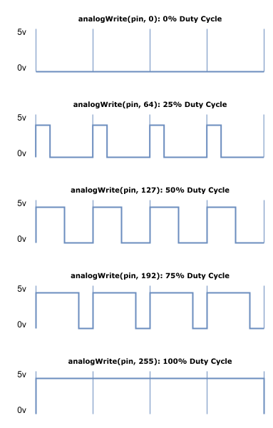
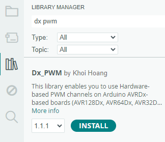

## Pulse Width Modulation

### What is Pulse Width Modulation?

**Digital vs. Analog Signals:**  
Digital signals are binary (0 or 1), while analog signals have a continuous range of values. To convert analog input into a digital format, we use an **Analog-to-Digital Converter (ADC)**.

**Controlling Analog Devices with Digital Signals:**  
  To control analog devices with a digital signal, a **Digital-to-Analog Converter (DAC)** is typically used to generate true analog signals.

**PWM as an Alternative to DAC:**  
  However, **Pulse Width Modulation (PWM)** offers a cost-effective alternative to a DAC by mimicking analog behavior with a digital signal. PWM can control devices like motors and lights, producing an analog-like signal instead of a true analog output.

**How PWM Works:**  
  PWM generates a variable output voltage by rapidly switching a pin between high and low states at a fixed **frequency**. The **duty cycle** (the percentage of time the pin is high) determines the average voltage output. By increasing or decreasing the relative on-time, the average voltage changes. This average voltage provides a lower power equivalent, while still maintaining full voltage during the pulse's on-state.

**Applications of PWM:**  
  PWM is widely used in various applications that require the control of power and brightness:
  - **Motor Speed Control:** Adjusting the speed of motors by controlling the average voltage delivered.
  - **LED Dimming:** Adjusting the brightness of LEDs by changing the duty cycle.
  - **Audio Synthesis:** Modulating audio signals for sound generation.

**Advantages of PWM:**  
  - **Cost-Effective:** PWM provides an inexpensive way to simulate analog control without requiring expensive DACs.
  - **Efficiency:** PWM can efficiently control power while reducing power losses, as full voltage is only used during 
the pulse’s on-state.

### What are the Key Parameters of PWM?

#### Frequency
Frequency measures how fast the signal is alternating between HIGH and LOW. It is measured in Hz.
Its inverse is the full period time interval. 

```
    Frequency = (1 / Period) Hz
```

#### Duty Cycle
The duty cycle is the fraction of time the signal is "high" versus "low". It is expressed
as a percentage. The duty cycle formula is as follows:

```
    Duty Cycle = (Time On Within Period) / (Period) * 100%
```

### PWM on the Curiosity Nano
The AVR64DD32 microcontroller provides hardware support for generating PWM signals through its 
internal timers. These signals are mapped to specific I/O pins that can output the PWM waveform when 
configured properly. The PWM functionality is provided by timers that are responsible for generating 
the pulse train.

It uses three primary timers—TCA, TCB, and TCD—to generate PWM signals. 
Each timer has different modes of operation, providing flexibility in how the PWM signals are generated.

The following pins on Curiosity Nano Evaluation Kit can be easily configured for generating PWM output:

- PIN_PD1
- PIN_PD2
- PIN_PD3

On the **Explorer Board**, you will find an RGB LED connected to those PWM outputs.
We will be utilizing it to evaluate the functionality of PWM generation.


### Pin Functionality

Generating PWM output on the Curiosity Nano requires a simple set up. If you want to use PD1 for PWM, 
you would configure Timer A (TCA0) to output PWM on Port D. 

This setup would involve:

1. Setting the correct PORTMUX[^1] register to route the PWM signal to Port D.
2. Configuring the TCA registers for the desired PWM frequency and duty cycle.[^2]

This bit field controls the pin positions for TCA0 signals.


The following line would ensure that the PWM signal generated by TCA0 is routed to PORTD,
where PD1, PD2, and PD3 are located, allowing them to function as PWM outputs.

```
PORTMUX.TCAROUTEA = PORTMUX_TCA0_PORTD_gc;
```

[^1] The PORTMUX (Port Multiplexer) is a feature in the AVR64DD32 microcontroller that allows you to
remap or reassign specific peripheral functions to different pins based on their available ports.

[^2] analogWrite() encapsulates this functionality. We will explore analogWrite() in the sample sketches.

### Sample Sketches 

#### Sketch 1: analogWrite

`analogWrite` simulates an analog signal by generating a Pulse Width Modulation (PWM) signal, where the perceived 
voltage is controlled by adjusting the duty cycle of the signal. For example, a 50% duty cycle (pin HIGH for half 
the time and LOW for the other half) simulates half the maximum voltage. If the pin is connected to a device like an 
LED or a motor, the rapid switching is perceived as a dimmer LED or a slower motor speed because of the averaging effect.

In Arduino, the `analogWrite` function is used to output a PWM signal to a specified pin with a certain duty cycle.

The graphic below illustrates how analogWrite() uses a value in the range of 0 to 255 to control the duty cycle. 



The following sketch demonstrates how to fade the brightness of the Explorer Board's RGB LED connected to pins **PD1**, 
**PD2**, and **PD3**, corresponding to red, green, and blue. Each color's brightness is adjusted one at a time, 
creating a fading effect. This sketch has been adapted for the **AVR64DD32** microcontroller from the original example 
found at: **File -> Examples -> 03.Analog -> AnalogWriteMega**.

1. Start by defining constants to hold the range of pins to control. By using `lowestPin` and `highestPin`, the program
can iterate through all three pins dynamically.

``` 
    const int lowestPin = PIN_PD1;
    const int highestPin = PIN_PD3;
``` 

2. Configure the microcontroller to route the TCA0 signal (Timer/Counter A) to PORTD, where the pins PD1, PD2, and PD3
are located.

``` 
    void setup() {
      // Re-route the signal generated by TCA0 to PORTD (which includes PD1, PD2, PD3)
      PORTMUX.TCAROUTEA = PORTMUX_TCA0_PORTD_gc;
    }
``` 

3. In an outer for loop, iterate over the selected pins to control them one at a time. 

``` 
    void loop() {
      // Iterate over the pins (Red -> Green -> Blue):
      for (int thisPin = lowestPin; thisPin <= highestPin; thisPin++) {
``` 

4. First, write an inner for loop to gradually increase the brightness of the current LED with a value from 0 to 255.   

``` 
        // Fade the LED on thisPin (Red, Green, or Blue) from off to brightest:
        for (int brightness = 0; brightness < 255; brightness++) {
          analogWrite(thisPin, brightness); // Adjust brightness for this pin
          delay(2); // Delay to control the fade speed
        }
``` 

5. Second, write another inner for loop to gradually decrease the brightness of the current LED with a value from 255 to 0.

``` 
        // Fade the LED on thisPin (Red, Green, or Blue) from brightest to off:
        for (int brightness = 255; brightness >= 0; brightness--) {
          analogWrite(thisPin, brightness); // Adjust brightness for this pin
          delay(2); // Delay to control the fade speed
        }
```
6. Pause for 100 milliseconds before fading the next color. Close the outer loop and the loop() function.  

```
        // Pause between color changes:
        delay(100);
      }
      
    }
```

#### Sketch 2: Potentiometer Dimming

This sketch allows you to adjust the brightness of the RGB LED using the potentiometer on the Curiosity Nano Explorer Board. 
It is based on the sample sketch located in **File -> Examples -> 03.Analog -> AnalogInOutSerial**, adapted for the AVR64DD32.
The sketch continuously reads the analog value from the potentiometer connected to PIN_PD7 using analogRead().
It uses the map() function to scale the unsigned 10-bit input value (0-1023) to an unsigned 8-bit value (0-255), which
corresponds to the PWM duty cycle for controlling the LED's brightness. 

For debugging purposes, the raw potentiometer value (`sensorValue`) and the mapped PWM output value (`outputValue`)
are printed to the Serial Monitor. This allows you to observe the changes in brightness as the potentiometer is adjusted.

1. Define `analogInPin` as `PIN_PD7` to read input from the potentiometer, and `analogOutPin` as `PIN_PD1` to control 
the red LED using PWM. Initialize `sensorValue` to store the potentiometer reading and `outputValue` to store the 
mapped PWM brightness value.

```
    const int analogInPin = PIN_PD7;  // Analog input pin where the potentiometer is connected
    const int analogOutPin = PIN_PD1;  // Analog output pin where the LED (RGB) is connected
    
    int sensorValue = 0;  // Variable to store the value read from the potentiometer
    int outputValue = 0;  // Variable to store the mapped PWM value for controlling LED brightness
```
2. In the setup() function, configure serial communication by swapping UART pins with Serial.swap(3) and starting 
communication at 115200 baud with Serial.begin(115200). Enable PWM output on Port D.

```
    void setup() {
      // Initialize serial communication at 115200 baud rate
      Serial.swap(3);  // Swap UART for serial communication
      Serial.begin(115200);  // Start serial communication
      
      // Set up the port multiplexer to route the PWM signal to Port D
      // This enables PWM output on pins PD1 to PD3
      PORTMUX.TCAROUTEA = PORTMUX_TCA0_PORTD_gc;
    }
```

3. In the loop() function, read the potentiometer value using analogRead(analogInPin) and map it from the range
0-1023 to 0-254 using map(). 

```
    void loop() {
      // Read the analog value from the potentiometer (range: 0 to 1023)
      sensorValue = analogRead(analogInPin);
      
      // Map the sensor value (0-1023) to the PWM range (0-254)
      // PWM has a range of 0-255, but 254 is used to avoid full duty cycle
      outputValue = map(sensorValue, 0, 1023, 0, 254);
```

4. Adjust the LED brightness by writing the mapped value to the output pin with analogWrite(analogOutPin, outputValue). 
Print the sensor and output values to the Serial Monitor for debugging using Serial.print().
```
      // Write the mapped PWM value to the output pin, adjusting LED brightness
      analogWrite(analogOutPin, outputValue);
    
      // Print the sensor value and the corresponding PWM output value to the Serial Monitor
      // Helps in debugging and observing the effect of the potentiometer
      Serial.print("sensor = ");
      Serial.print(sensorValue);
      Serial.print("\t output = ");
      Serial.println(outputValue);
```

5. Finally, include a 2-millisecond delay with delay(2) to allow the ADC to stabilize before the next reading. Close
the loop function.
```    
      // Wait for 2 milliseconds to allow the analog-to-digital converter to settle before the next reading
      delay(2);
    }
```
#### Sketch 3: Additional Libraries

This sketch uses the **Dx_PWM** library to control the brightness of a white light on an RGB LED by generating PWM signals
on three pins (PD1, PD2, and PD3) simultaneously. By adjusting the duty cycle of the PWM signals for each color (Red, 
Green, and Blue), it gradually increases and decreases the brightness of the combined white light. The sketch allows 
for precise control of the white light intensity and prints the pin information and duty cycle to the serial monitor.

Please open the Library Manager, search for Dx PWM, and download and install the library. 



We will revisit the Dx_PWM library when using PWM to control the tone or frequency that the speaker produces.

While the standard Arduino analogWrite() function easily supports PWM output on a single pin at a time, this sketch 
allows for simultaneous control of PWM on three pins for the RGB LED, something that would require more effort to 
achieve with analogWrite().

It is based on sample sketches available at the Dx_PWM repo. The Dx_PWM library leverages the PWM's 16-bit precision,
which is quite fine-grained for PWM control.

1. Include the `Dx_PWM` library, create an array of PWM_Pins, declare an array of Dx_PWM instances to control each pin, 
and format a string for Serial Monitor output.   

```    
    #include "Dx_PWM.h"
    
    #define SerialDebug   Serial

    // Define an array of pins where the RGB LED is connected (PD1, PD2, PD3 for red, green, blue)
    uint32_t PWM_Pins[] = { PIN_PD1, PIN_PD2, PIN_PD3 };
    
    // Define the number of PWM pins (for RGB LED, there are 3 pins)
    #define NUM_OF_PINS   ( sizeof(PWM_Pins) / sizeof(uint32_t) )
    
    // Create an array of PWM instances for controlling each pin
    Dx_PWM* PWM_Instance[NUM_OF_PINS];
    
    // String to separate output in the Serial Monitor for better readability
    char dashLine[] = "======================================";
```    

2. Implement a helper function for debugging that will display the current pin and duty cycle on the 
Serial Monitor.

```    
    // Function to print detailed PWM information for each pin
    void printPWMInfo(Dx_PWM* PWM_Instance)
    {
      SerialDebug.println(dashLine);  // Print a line for separation
      SerialDebug.print("Actual data: pin = ");
      SerialDebug.print(PWM_Instance->getPin());  // Print the current pin
      SerialDebug.print(", PWM DC = ");
      SerialDebug.println(PWM_Instance->getActualDutyCycle());  // Print the current duty cycle (PWM brightness)
      SerialDebug.println(dashLine);  // Print a line for separation
    }
``` 

3. Configure PORTMUX to enable PWM on port D, enable the Serial debugger and initialize each PWM instance by passing
the pin reference as an argument to the constructor. 

``` 
    void setup()
    {
      // Set up the PORTMUX to route the TCA (Timer/Counter A) to Port D, enabling PWM on pins PD1, PD2, PD3
      PORTMUX.TCAROUTEA = PORTMUX_TCA0_PORTD_gc;
      
      // Initialize the Serial communication for debugging
      SerialDebug.swap(3);  // Swap UART (necessary for correct serial output)
      SerialDebug.begin(115200);  // Start the serial communication at 115200 baud rate
      
      // Initialize each PWM pin and create an instance of the Dx_PWM object for each pin
      for (uint8_t index = 0; index < NUM_OF_PINS; index++)
      {
        pinMode(PWM_Pins[index], OUTPUT);  // Set each PWM pin as an output
        PWM_Instance[index] = new Dx_PWM(PWM_Pins[index], 100.0f, 100.0f);  // Create a new Dx_PWM instance for each pin.
      }
    }
``` 

4. Loop from 10% brightness (6656) to 90% brightness (58880) in steps of 6656. For each value, loop through each 
PWM pin, calculate the duty cycle as a percentage, and set the new brightness. Add a short delay and print the current
PWM information to the Serial Monitor.

``` 
    void loop()
    {
      // Gradually increase the duty cycle (brightness) of the LED from a low value (6656) to a high value (58880)
      for (uint16_t j = 6656; j <= 58880; j += 6656) {
        // Loop through each PWM pin (PD1, PD2, PD3)
        for (uint8_t index = 0; index < NUM_OF_PINS; index++) {
          // Convert the value `j` to a percentage for the duty cycle
          float dutyCycle = (j / (float)65536) * 100.0;
          
          // Set the duty cycle for the current pin
          PWM_Instance[index]->setPWM(PWM_Pins[index], 100.0f, dutyCycle);
          
          // Delay for 10 milliseconds
          delay(10);

          // Print the current PWM information to the Serial Monitor
          printPWMInfo(PWM_Instance[index]);
        }
      }
      
``` 

5. Backwards from the previous step, loop from 90% brightness (58880) to 10% brightness (6656) in steps of 6656. 
For each value, loop through each PWM pin, calculate the duty cycle as a percentage, and set the new brightness. 
Add a short delay and print the current PWM information to the Serial Monitor. Close the outer loop and the loop() 
function.

``` 
    
      // Gradually decrease the duty cycle (brightness) of the LED from the high value (58880) back to the low value (6656)
      for (uint16_t j = 58880; j >= 6656; j -= 6656) {
        // Loop through each PWM pin (PD1, PD2, PD3)
        for (uint8_t index = 0; index < NUM_OF_PINS; index++) {
          // Convert the value `j` to a percentage for the duty cycle
          float dutyCycle = (j / (float)65536) * 100.0;
          
          // Set the duty cycle for the current pin
          PWM_Instance[index]->setPWM(PWM_Pins[index], 100.0f, dutyCycle);

          // Delay for 10 milliseconds
          delay(10);
          
          // Print the current PWM information to the Serial Monitor
          printPWMInfo(PWM_Instance[index]);
        }
      }
    }
```