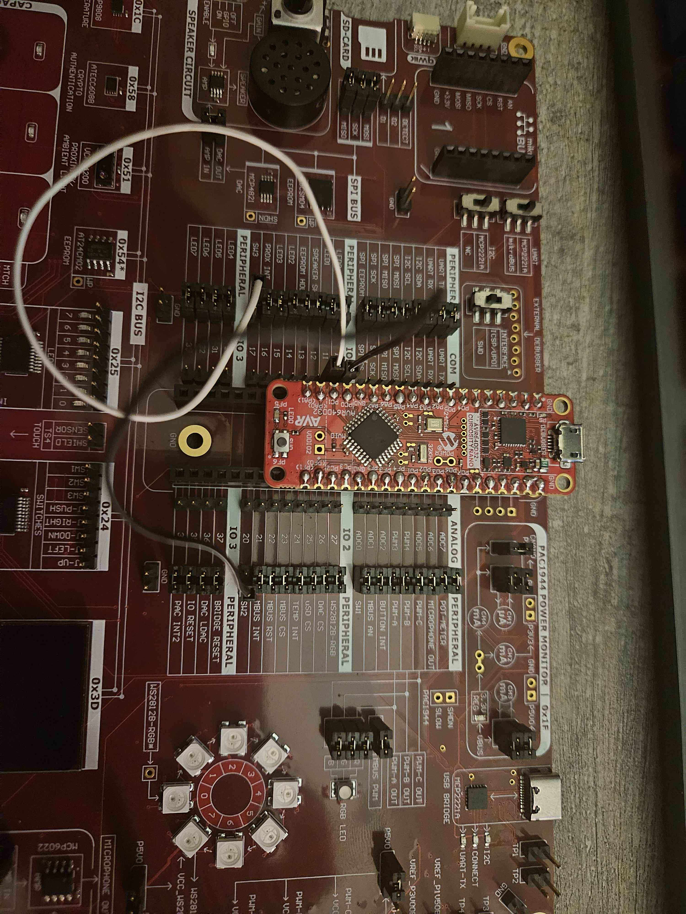

## Lab Walk Through

# Code Walkthrough for Password Entry

This code is designed to handle the password entry for a smart lock system. The password is either set by a new user 
or verified by an existing user. The system uses an OLED display to show the password entry process and EEPROM to
store and retrieve the password.

First, include the necessary external libraries to support OLED display and EEPROM password storage.
Instantiate an OLED display object. Set the password slot to 11, as we already utilized the first 10 slots in our 
previous EEPROM sketch.

    #include <SPI.h>
    #include <Wire.h>
    #include <Adafruit_GFX.h>
    #include <Adafruit_SSD1306.h>
    #include <EEPROM.h>

    #define SCREEN_WIDTH 128      // OLED display width, in pixels
    #define SCREEN_HEIGHT 64      // OLED display height, in pixels
    #define OLED_RESET -1         // Reset pin, set to -1 to share Arduino reset pin
    #define SCREEN_ADDRESS 0x3D   // 7-bit I2C Address
    Adafruit_SSD1306 display(SCREEN_WIDTH, SCREEN_HEIGHT, &Wire, OLED_RESET);
    uint8_t pos = 5;

    #define PASSWORD_SLOT 11

Initialize the display and draw 6 underscore characters on the display as placeholders for the password. Swap 
the default UART pins to the appropriate ones, and call the checkForStoredPassword() function. he successful execution 
of checkForStoredPassword() allows the program to proceed to the next step in the setup() function, 
where we can continue to the loop function.

    void setup() {
      delay(1000); // Wait for the display to ready
      if (!display.begin(SSD1306_SWITCHCAPVCC, SCREEN_ADDRESS)) {
        for(;;); // Display not connected or malfunctioning, loop forever
      }
      display.clearDisplay();
      for (int i = 0; i < 6; i++) {
        display.drawChar(pos, 40, '_', 1, 0, 2);
        display.drawChar(pos, 40, ' ', 1, 0, 1);
        pos += 20;
      }
      display.display(); // Display draw operations on screen
      Serial.swap(3);
      Serial.begin(115200);
      delay(100);
      checkForStoredPassword();

The checkForStoredPassword() function checks if there is a stored password by reading the EEPROM at the PASSWORD_SLOT.
If a password exists, it prompts the user to enter the password. If no password is found,
it prompts the user to create a new one.

    void checkForStoredPassword() {
      Serial.println("Welcome!");
      if (EEPROM.read(PASSWORD_SLOT) != 0xFF) {
        Serial.println("Password found. Please enter the stored password.");
        handlePasswordInput(false);
      }
      else {
        Serial.println("No password found. Create a new one.");
        handlePasswordInput(true);
      }
    }

The function handlePasswordInput() prompts the user to either create a new password or enter an existing one. It reads
the input from the serial monitor, checking that it is exactly 6 characters long. If creating a new password, it calls 
savePassword(input) to store the password in EEPROM. If verifying an existing password, it calls verifyPassword(input) 
to check if the entered password matches the stored password. If the password is incorrect, it asks the user to try again.

    void handlePasswordInput(bool newUser) {
      Serial.println(newUser ? "Create a new password:" : "Enter your password:");
      String input;
      bool passed = false;
      while (!passed) {
        pos = 5;
        if (Serial.available() > 0) {
          input = Serial.readStringUntil('\n'); // Read the input until newline
          if (input.length() == 6) {
            for (int i = 0; i < 6; i++) {
              char displayChar = (i < input.length()) ? input[i] : ' ';
              display.drawChar(pos, 20, displayChar, 1, 0, 2);
              display.drawChar(pos, 40, '_', 1, 0, 2);
              pos += 20;
            }
            if (newUser) {
              passed = true;
              savePassword(input);
            }
            else {
              if (verifyPassword(input)) {
                passed = true;
              }
              else {
                Serial.println("Incorrect Password. Try Again.");
              }
            }
          }
          else {
            Serial.println("Password must be exactly 6 characters. Try again.");
          }
        }
        display.display();
      }
    }

The function savePassword() saves the 6-digit password entered by the user into the EEPROM, starting from address 11.
Each character in the password is converted to an integer and stored in consecutive EEPROM locations.

    void savePassword(String input) {
      for (int i = 0; i < 6; i++) {
        int cell = i + 11;
        int digit = input[i] - '0';
        EEPROM.update(cell, digit);
      }
      int read_value;
      for (EEPtr ptr = 11; ptr.index < 17; ptr++) {
        read_value = *ptr;
      }
    }

This function verifyPassword(String input) checks if the entered password matches the stored password in EEPROM. 
It compares each digit of the input password with the corresponding value in EEPROM. If any digit does not match, 
it returns false, indicating an incorrect password.

    bool verifyPassword(String input) {
      int read_value;
      int i = 0;
      for (EEPtr ptr = 11; ptr.index < 17; ptr++) {
        read_value = *ptr;
        int digit = input[i] - '0';
        if (digit != read_value) {
          return false;
        }
        i++;
      }
      return true;
    }

After the password is successfully matched, the user will be granted access to the home system, and the system will 
print "Login success!" to indicate that the user is authorized.

      Serial.println("Login success!");
    }

At this point, the setup() function will complete its execution, and the program will move to the loop() function. 
The loop() function is where the main operation of the home system begins. This function will be used to manage the
various home automation and monitoring tasks.

    void loop() {
      // Functionality for home monitoring and automation. 
    }

# Code Walkthrough for MCP9808 Temperature Sensor with RGB LED

Objective
This program demonstrates how to read temperature data from the MCP9808 sensor via I²C communication and visualize it using an RGB LED. The LED color transitions smoothly from blue (indicating cold) to red (indicating hot) based on the temperature range.

Include the necessary library for I²C communication:

    #include <Wire.h>

The Wire.h library is essential for establishing I²C communication between the Curiosity Nano and the MCP9808 temperature sensor.
Define the I²C address of the MCP9808 temperature sensor:

    #define MCP9808_ADDR 0x1C

The sensor's default I²C address (0x1C) is stored as a constant for convenience.
Assign pins for the RGB LED and define the temperature range:

    const int RED_PIN = 13;   // Pin for red LED
    const int BLUE_PIN = 15;  // Pin for blue LED
    const float TEMP_MIN = 0.0;   // Minimum temperature for blue
    const float TEMP_MAX = 40.0;  // Maximum temperature for red

These constants set up the hardware configuration and specify the temperature range for color interpolation.
Setup Function
Initialize I²C and UART Communication:

    void setup() {
      Wire.begin(); // Initialize I²C communication
      Serial.swap(3);
      Serial.begin(115200); // Initialize UART communication
    }

Wire.begin() sets up I²C communication.
Serial.begin(115200) initializes serial communication for debugging purposes. Serial.swap(3) reassigns UART to alternate pins.
Configure the RGB LED Pins:

    pinMode(RED_PIN, OUTPUT);
    pinMode(BLUE_PIN, OUTPUT);

Sets the red and blue pins as outputs to control the RGB LED.
Set MCP9808 to Continuous Conversion Mode:

    Wire.beginTransmission(MCP9808_ADDR);
    Wire.write(0x01); // Access the configuration register
    Wire.write(0x00); // Set continuous conversion mode
    Wire.write(0x00);
    Wire.endTransmission();

Continuous conversion mode allows the sensor to measure temperature continuously and update its registers with the latest data.
Loop Function
Read Temperature and Update LED Colors:

    void loop() {
      float temperature = readTemperature();
      Serial.print("Temperature: ");
      Serial.print(temperature);
      Serial.println(" °C");
    
      updateLEDColor(temperature); // Adjust the LED based on temperature
      delay(1000); // Delay for 1 second
    }

The loop() function continuously reads the temperature using the readTemperature() function and updates the LED color using the updateLEDColor() function. The delay(1000) ensures the temperature is updated once per second.
Reading Temperature

    float readTemperature() {
      Wire.beginTransmission(MCP9808_ADDR);
      Wire.write(0x05); // Access the temperature register
      Wire.endTransmission();
      
      // Request two bytes of temperature data
      Wire.requestFrom(MCP9808_ADDR, 2);
      byte msb = Wire.read();
      byte lsb = Wire.read();
      
      // Combine and convert the data
      int temp = ((msb & 0x1F) << 8) | lsb; // Extract temperature value
      if (msb & 0x10) { // Check for negative temperatures
        temp -= 4096;
      }
      return temp * 0.0625; // Convert to Celsius
    }

Function Purpose: This function reads the temperature data from the MCP9808 and processes it to return a value in Celsius.
How It Works:
Requests data from the temperature register (0x05).
Reads two bytes and combines them to form the raw temperature value.
Converts the raw value to a temperature in Celsius using the MCP9808's conversion factor (0.0625°C per unit).
Updating the RGB LED

    void updateLEDColor(float temperature) {
      // Clamp temperature to the defined range
      if (temperature < TEMP_MIN) temperature = TEMP_MIN;
      if (temperature > TEMP_MAX) temperature = TEMP_MAX;
      
      // Calculate interpolation factor (0.0 to 1.0)
      float factor = (temperature - TEMP_MIN) / (TEMP_MAX - TEMP_MIN);
      
      // Determine RGB values
      int redValue = int(factor * 255);    // Red intensity increases with temperature
      int blueValue = int((1 - factor) * 255); // Blue intensity decreases with temperature
      
      // Debugging output
      Serial.print("Red: ");
      Serial.println(redValue);
      Serial.print("Blue: ");
      Serial.println(blueValue);
      
      // Update LED color using PWM
      analogWrite(RED_PIN, redValue);
      analogWrite(BLUE_PIN, blueValue);
    }

Function Purpose: This function adjusts the RGB LED color based on the current temperature.
How It Works:
Clamping: Ensures the temperature stays within the defined range (TEMP_MIN to TEMP_MAX).
Interpolation: Calculates a factor to linearly interpolate between the minimum and maximum temperature range.
Color Adjustment: Sets red and blue intensities based on the interpolation factor. Cooler temperatures favor blue, while warmer temperatures favor red.
PWM Control: Sends the calculated values to the LED using analogWrite().

# Door Bell Walkthrough
Objective: Implement a functioning doorbell using PWM and capacitive touch sensor in the middle.

Implementing a door bell is slightly challenging since we cannot use delay functions as it would interfere with other code in the loop function.
The door bell consists of two parts: reading input from the capacitive touch sensor and playing notes on the speaker using PWM.
First, we need to import the Dx_PWM library and setup the speaker and capacitive touch pins. We will also use an external file for the notes.
```
#include <Dx_PWM.h>
#include "notes.h"

#define DOOR_BELL PIN_PC2
#define SPEAKER_PIN PIN_PD2
```

Before the setup function, we set up doorbell tones and declare a note duration:
```
#define NOTE_PERIOD 750
#define DOOR_NOTES_COUNT 2
float door_notes[] = {NOTE_A6S, NOTE_F6S};
```

We will also need to initialize the Dx_PWM class to play notes through PWM.
```
Dx_PWM* speaker;
``` 

In the setup function, we will need to set the pinModes for the pins and reroute the PWM timer.
```
void setup() {
  pinMode(DOOR_BELL, INPUT);
  pinMode(SPEAKER_PIN, OUTPUT);
  
  PORTMUX.TCAROUTEA = PORTMUX_TCA0_PORTD_gc;
  speaker = new Dx_PWM(SPEAKER_PIN, 1000.0f, 0.0f);
}
```

In the loop function, we will setup the following code:
```
void loop() {
  static int speaker_index = -1;
  static uint16_t speaker_timer = 0;
  uint16_t now = millis();

  if (speaker_index != -1 && now - speaker_timer > NOTE_PERIOD) {
    speaker_timer = now;
    speaker_index++;
    if (speaker_index < DOOR_NOTES_COUNT) {
      speaker->setPWM(SPEAKER_PIN, door_notes[speaker_index], 0.0f);
    } else {
      speaker_index = -1;
      speaker->setPWM(SPEAKER_PIN, 0.0f, 0.0f);
    }
  }

  bell_value = digitalRead(DOOR_BELL);
  if (bell_value == LOW && speaker_index == -1) {
    speaker_index = 0;
    speaker->setPWM(SPEAKER_PIN, door_notes[speaker_index], 0.0f);
    speaker_timer = now;
  }
}
```

In the beginning part of the loop function, we set up a few static (meaning consistent between function runs) variables to store the speaker index, which is used to track which note is being played, and the speaker timer, which is used to track when the speaker should move on the next note. The speaker index is set to -1 as a default state to indicate that it is not playing.
In the first if statement, it is checking if the speaker is not playing and checks if the time (note period) since the last note has passed already. When these conditions are met, the speaker timer is updated to the current time, effectively resetting the timer.
Then, the speaker index is incremented and checked if all notes have been played. If all notes have not been played (ie. not at the end of the note array), then we will continue on to the next note.

In the second half, we read the value from the capacitive touch sensor. When the sensor is being pressed, the value is LOW so we check in the if statement if the sensor is being pressed and that the speaker is not already playing.
Then, the speaker index is updated to 0 and the first note is played from the note array.

The capacitive touch sensor and speaker need to be connected via pin remapping, so we will reroute PIN_PC3 to the capacitive touch button's TS4 sensor pin and the PIN_PD2 to the AMP_IN pin to the right of the speaker.

# Code Walkthrough for Smart Lighting
Objective: 
This program demonstrates how to wire the bottom-left switches to the curiosity nano and utilize them to change the color of the Neo Pixel LEDs.

Before we begin with the code, we will have to take special steps in order to wire the SW2 and SW3 to the Curiosity Nano. This is because the Curiosity Nano is too short to reach the pins from the Curiosity Nano Explorer board that correspond to these, so, we will remap them like in the image below to get these functioning (it does not have to be these specific pins we remap to, but the rest of the guide will be based on them, if you choose somewhere else, make sure it doesnt break any other functionality!) 



With that remapping done, we can begin with our basic imports. (Again, remember to refer to pins_arduino.h for your board for the pin numbers!)

```
#define SWITCH_ONE 22 
#define SWITCH_TWO 8
#define SWITCH_THREE 9

#include <tinyNeoPixel.h>
```

Next, we will declare 2 variables we will use for this program, one being a reference to the pixel_ring, with the other being a static list with the necessary colors we want to switch between

```
tinyNeoPixel pixel_ring = tinyNeoPixel(8, PIN_PC3, NEO_GRB + NEO_KHZ800);
unsigned long color_grid[3] = { 0x00007f, 0x007f00, 0x7f0000 };  // Red, green, and blue
```

In our setup function, we will begin our pixel_ring connection, as well as enabling the specified pins as input. 

```
void setup() {
  pixel_ring.begin();
  pinMode(SWITCH_ONE, INPUT);
  pinMode(SWITCH_TWO, INPUT);
  pinMode(SWITCH_THREE, INPUT);
}
```

Now, in this demonstration I will do it as changing all of the LEDs to the specified color, but ideally, it would be on a per-room basis as with the room selector. In either case, we will get input from the buttons

```
void loop() {
  // put your main code here, to run repeatedly:
  int i = 0;
  static uint8_t color_index[8] = { 0 }; // Instantiate 8 slots all with default value of 0

  int switch_one_value = digitalRead(SWITCH_ONE);
  int switch_two_value = digitalRead(SWITCH_TWO);
  int switch_three_value = digitalRead(SWITCH_THREE);

  pixel_ring.clear();
  for(i = 0; i < 8; i++) {
    // This is just one way to do the condition, basic idea is bias left most on over right, remember, board is active LOW
    color_index[i] = switch_one_value == LOW ? 0 : switch_two_value == LOW   ? 1
                                                         : switch_three_value == LOW ? 2
                                                                                     : color_index[pixel_index];
    pixel_ring.setPixelColor(i, color_grid[color_index[i]]);
  }
  pixel_ring.show();
}
```

Here, we make a static array of size 8 to hold our value at every LED index, and assess whichc color to assign it based off of which button is being pressed by reading in whether it is actively being pressed using digitalRead. This code can be slightly altered when doing the room selector to only change the color of the selected room rather than having a loop to change all of the LEDs to the selected color. That's it for the Smart Lighting!

# Code Walkthrough for Room Selector and joystick 
Objective: 
This program connects the potentiometer's read value to determine the selected index (1-8) on the neo pixel ring

This walkthrough will be very closely tied to the SmartLighting one, and will give you the basics to modify the SmartLighting to include room selection. So if some of the steps or imports seem familiar, that's why! We will start by importing our necessary libraries, with 2 real notable ones being the definition for the Potentiometer pin, which in this case was 19 per the pins_arduino.h for the Curiosity Nano/32DD series boards; And the other being the Adafruit_MCP23008.h, which we will be using to get the Joystick input. If you remember the amber LEDs from previous labs, this component is the similar looking one on the right of the Amber LED MCP23008. 

```
#define POTMETERPIN 19
#include "Adafruit_MCP23008.h"
#include <tinyNeoPixel.h>

Adafruit_MCP23008 joystick;
tinyNeoPixel pixel_ring = tinyNeoPixel(8, PIN_PC3, NEO_GRB + NEO_KHZ800);
unsigned long color_grid[3] = { 0x00007f, 0x007f00, 0x7f0000 };
```

In our setup function, we do a few things, firstly, we use Serial.swap and Serial.begin to allow us to print to the UART, this is primarily just for showing the input from the joystick. Next we again begin the pixel_ring connection, and finally we begin the joystick at the given I2C address (found printed above the component on the board) and enable all of the Joystick pins as input so we can get data in from them. NOTE: the joystick.pullUp call is optional but helps to reset the position after letting go of whatever direction you are pointing the joystick. Without this, after pushing up it is likely to keep saying you are pushing up even after letting go.

```
void setup() {
  Serial.swap(3);
  Serial.begin(115200);

  pixel_ring.begin();

  uint8_t pin_id;
  joystick.begin(0x24);
  for (pin_id = 0; pin_id < 5; pin_id++) {
    joystick.pinMode(pin_id, INPUT);
    joystick.pullUp(pin_id, HIGH);
  }
}
```

Finally our large loop function, in this case, we will only be using the 'Red' value, but if you have the SmartLighting code functioning you can mix it with this to get it to function such that you can swap the color at any specific LED instance. From the top, we start by defining an unsigned integer to hold what LED we want to be lit up, defining the default as 0. We then read in the value of the Potentiometer (a value between 0-1024, as per analogRead's function), and split it into 8 separate sections. To accomplish this, I repeatedly subtract 128 until I can't anymore (again since 128 is 1/8 of 1024), giving us 8 sections or ranges that our potentiometer value can fall in. That gives us which index to light up, which all we have to do then is clear whatever is currently shown on the pixel ring (to ensure the previous one is turned off when changing) and set the led at the correct pixel_index to red, and show it. Moving to the joystick code, its fairly simple, just read in using digitalRead at the correct index (labeled on the component, with appropriate meaning such as Jleft being 1) and if it comes back as true then we display that text. 

```
void loop() {
  uint8_t pixel_index = 0;

  int readValue = analogRead(POTMETERPIN);

  while (readValue > 128) {
    readValue = readValue - 128;
    pixel_index++;
  }

  pixel_ring.clear();
  pixel_ring.setPixelColor(pixel_index, color_grid[0]); // Always Red
  pixel_ring.show();

  bool jUp = !joystick.digitalRead(0); 
  bool jLeft = !joystick.digitalRead(1);
  bool jDown = !joystick.digitalRead(2);
  bool jRight = !joystick.digitalRead(3);
  bool jIn = !joystick.digitalRead(4);

  if(jUp){
    Serial.println("Pushing up!");
  }
  if(jLeft){
    Serial.println("Pushing Left!");
  }
  if(jDown){
    Serial.println("Pushing Down!");
  }
  if(jRight){
    Serial.println("Pushing Right!");
  }
  if(jIn){
    Serial.println("Pushing In!");
  }
}
```

That's it for the room selector and joystick! The joystick code can basically stay on its own, but this room selector can be easily merged with the SmartLighting to change the color of any specific LED between Red, Green, and Blue and also store what it was set to for when you manuever back to that LED! Give it a try!  
