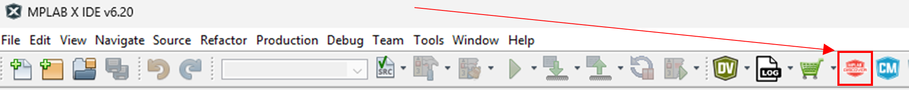
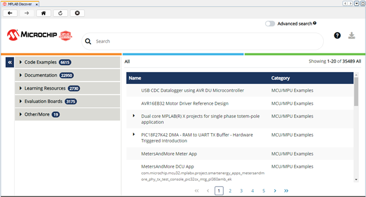
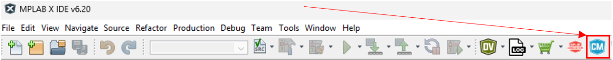
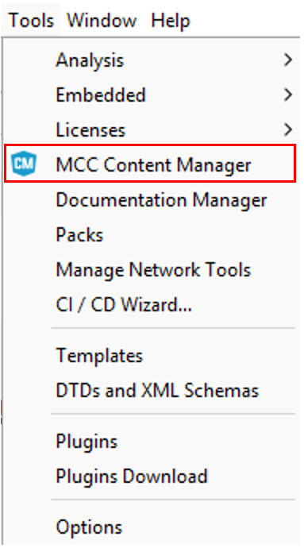
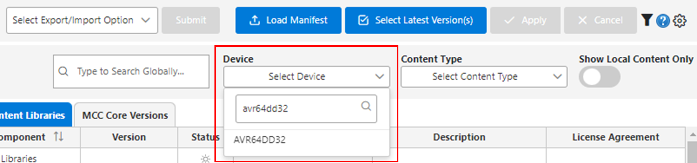
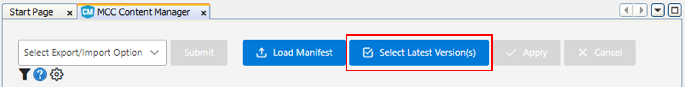

# **Quick Start Guide**

### 

## Required Materials

## Learning Objective

## What is MPLAB X IDE?
In this section of the course, we will be learning how to use another embedded programming program, MPLAB X IDE. MPLAB X IDE is a proprietary integrated development environment designed to work with Microchip's line of microcontrollers. It is most commonly used in professional or settings due to its encompassing set of developer features.

## Why use MPLAB X IDE over Arduino IDE?
Leading up to this lab, you have been developing relatively simple programs using Arduino IDE. So why switch over to MPLAB X IDE? The reason ultimately comes down to differences in features:

- MPLAB X IDE’s debugger offers deeper control of the chip’s embedded system with features such as register bit manipulation, breakpoints, call stack, memory monitoring, - application profiling, and pin manager
- MPLAB X IDE’s project based development makes it easier to build out multi file programs than Arduino IDE’s sketch based development.
- MPLAB X IDE’s Microchip Code Configurator simplifies adding peripherals to the project instead of relying on third party libraries to configure peripherals

Ultimately, MPLAB X presents a more well rounded developer experience with professional features for greater control over the microcontroller.

## Installation Walkthrough

1. Go to the MPLAB X download page on microchips website at https://www.microchip.com/en-us/tools-resources/develop/mplab-x-ide
2. Download the MPLAB X IDE installer (Windows)
3. Open the installer once it has finished downloading

## Tour of the Source Files

## Discover Portal

In this section, we will open MPLAB Discover. It is a searchable catalog for exploring project examples, documentation, 
tutorials, videos, source code and other resources for microcontroller devices.

1. Locate the MPLAB Discover icon in the toolbar menu.

    

2. This will open the Discover Portal. In the search bar, you can search for AVR64DD32 to find resources for the microcontroller.

    

## Content Manager

In this section, we will open the MCC Content Manager to update all libraries, drivers, and peripheral code 
related to the AVR64DD32. You need to have internet access to perform the updates.

1. Locate the 'CM' icon in the toolbar menu. Alternatively, access it by navigating to Tools -> MCC Content Manager.

        

2. In the search filters, open the 'Select Device' pull down menu under 'Device', then type 'AVR64DD32' to 
find the microcontroller. Click on it to select.

    

3. Click the Select Latest Version(s) button at the top center to choose the most recent versions of the libraries.

    

4. After performing this selection, click on 'Apply'.

    

5. Allow a few seconds for the libraries and drivers to download and install.

## Overview of Project Structure

In this section, we will go over the project structure displayed on the right-hand side of the screen in MPLAB X IDE. Under the Projects section, you will see your project name, and within each project, a series of organized files. These files are structured to ensure efficient development, debugging, and maintainability.

1. Project Root Folder
The Project Root Folder is the main directory that holds all project-related files. This folder is automatically created when you generate a new project and shares the same name as your project.

2. Header Files
Header files contain function prototypes, macro definitions, and global variables, allowing for modular programming and reusability. These files help structure the code by separating function declarations from their implementations.

3. Source Files
The Source Files section includes all C source files, including main.c. These files implement the logic of the program and may contain peripheral drivers, application logic, or other custom functionalities.

4. Important Files
These files are generated by MPLAB X IDE when the project is set up. They typically contain:

Configuration bit settings for the microcontroller.
Build process files and dependencies for compilation.
Other necessary system files used by the IDE.
5. Libraries
The Libraries section holds any external libraries that the project uses. These can include Microchip-provided libraries (such as MPLAB Harmony) or custom-built libraries for additional functionality.

6. Linker Files
Linker files define how the program code and data are allocated in memory. These scripts ensure proper memory management and execution flow within the microcontroller.

7. Loadables
This section contains additional executable files that can be loaded alongside the main firmware, such as:

Bootloader files – Used for firmware updates.
Secondary program images – Used for dual-program execution (e.g., diagnostics or alternate firmware modes).
By understanding this structured organization, developers can efficiently navigate their MPLAB X projects, ensuring better modularity, reusability, and debugging capabilities.

## Appendix
