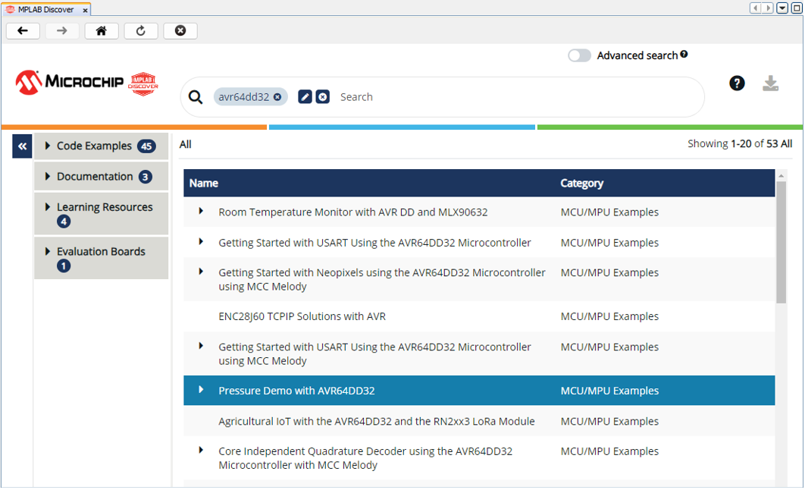
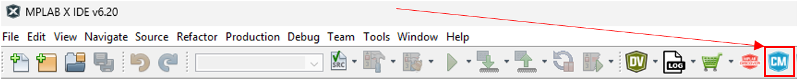
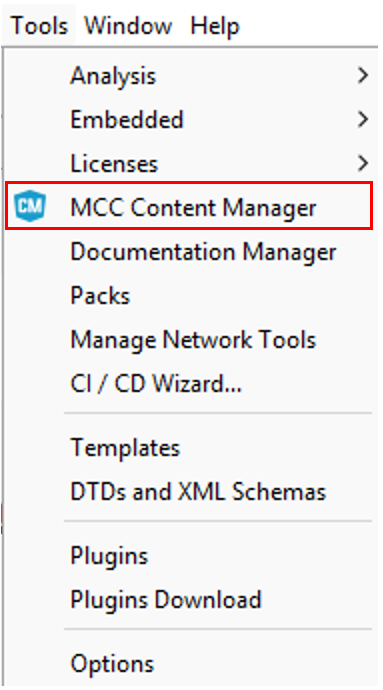
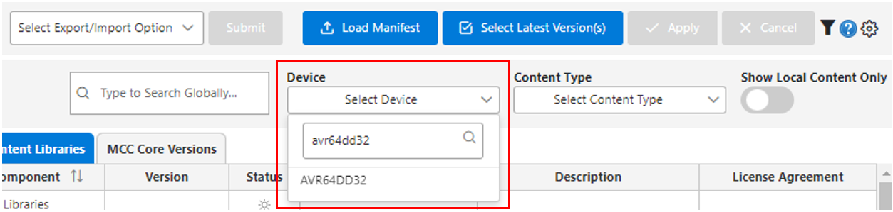
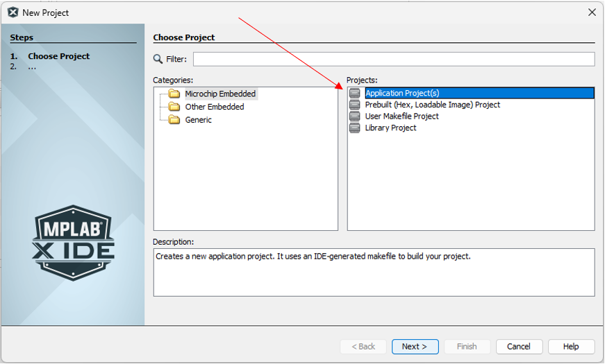
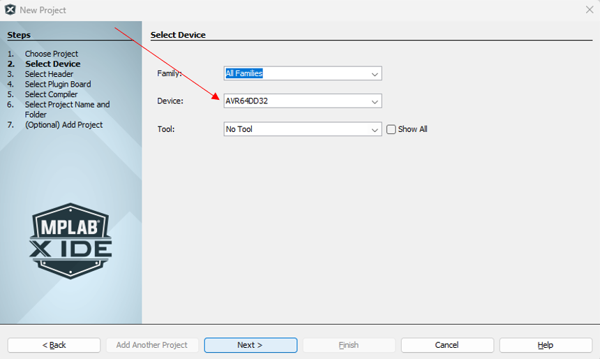
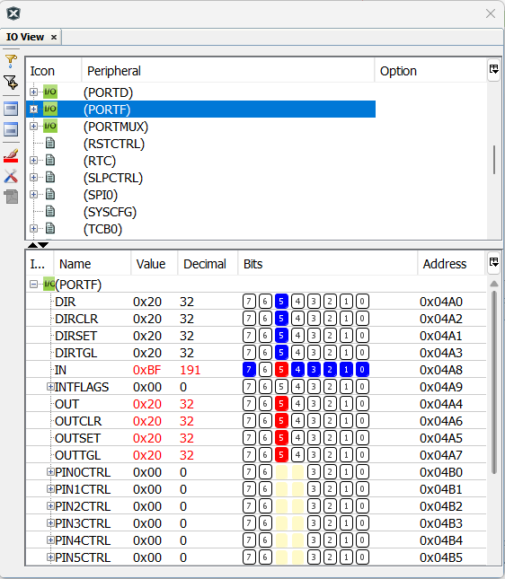

# **Quick Start Guide**

##  Required Materials


## Learning Objective

## What is MPLAB X IDE?
In this section of the course, we will be learning how to use another embedded programming program, MPLAB X IDE. MPLAB X IDE is a proprietary integrated development environment designed to work with Microchip's line of microcontrollers. It is most commonly used in professional or settings due to its encompassing set of developer features.

## Why use MPLAB X IDE over Arduino IDE?
Leading up to this lab, you have been developing relatively simple programs using Arduino IDE. So why switch over to MPLAB X IDE? The reason ultimately comes down to differences in features:

- MPLAB X IDE’s debugger offers deeper control of the chip’s embedded system with features such as register bit manipulation, breakpoints, call stack, memory monitoring, - application profiling, and pin manager
- MPLAB X IDE’s project based development makes it easier to build out multi file programs than Arduino IDE’s sketch based development.
- MPLAB X IDE’s Microchip Code Configurator simplifies adding peripherals to the project instead of relying on third party libraries to configure peripherals

Ultimately, MPLAB X presents a more well rounded developer experience with professional features for greater control over the microcontroller.

## Installation Walkthrough

1. Go to the MPLAB X download page on microchips website at https://www.microchip.com/en-us/tools-resources/develop/mplab-x-ide
2. Download the MPLAB X IDE installer (Windows)
3. Open the installer once it has finished downloading

## Tour of the Source Files

## Discover Portal

In this section, we will open MPLAB Discover. It is a searchable catalog for exploring project examples, documentation, 
tutorials, videos, source code and other resources for microcontroller devices.

1. Locate the MPLAB Discover icon in the toolbar menu.

    

2. This will open the Discover Portal. In the search bar, you can search for AVR64DD32 to find resources for the microcontroller.

    

## Configuration

This section covers a few important configurations for using MPLAB X. Some of these configurations are recommendations and do not need to be changed.

# Setting the Color Theme and Font

The default theme for MPLAB X is very bright and can be hard on the eyes, so many users prefer to change it. To adjust the theme:

1. Navigate to Tools → Options → Fonts & Colors.
2. Under Profile, select the theme you prefer. The recommended theme is Norway Today.
3. To change the font, locate the Font section and click on the three dots.
4. Select your desired font and size. The recommended font is Cascadia Code, as it matches the one used in Visual Studio Code.

# Managing Embedded Toolchains

The necessary toolchains should be added automatically when MPLAB X is installed. However, you can manage them manually if needed:

1. Go to Tools → Options → Embedded.
2. Within the Embedded options, select Building Tools.
3. You should see the XC8 compiler listed, which is the compiler we will use.


## Content Manager

In this section, we will open the MCC Content Manager to update all libraries, drivers, and peripheral code 
related to the AVR64DD32. You need to have internet access to perform the updates.

1. Locate the 'CM' icon in the toolbar menu. Alternatively, access it by navigating to Tools -> MCC Content Manager.

        

2. In the search filters, open the 'Select Device' pull down menu under 'Device', then type 'AVR64DD32' to 
find the microcontroller. Click on it to select.

    

3. Click the Select Latest Version(s) button at the top center to choose the most recent versions of the libraries.

    

4. After performing this selection, click on 'Apply'.

    

5. Allow a few seconds for the libraries and drivers to download and install. Plug in your board, and you should see the Curiosity Nano appear in your IDE!


## Overview of Project Structure

In this section, we will go over the project structure displayed on the right-hand side of the screen in MPLAB X IDE. Under the Projects section, you will see your project name, and within each project, a series of organized files. These files are structured to ensure efficient development, debugging, and maintainability.

1. Project Root Folder
The Project Root Folder is the main directory that holds all project-related files. This folder is automatically created when you generate a new project and shares the same name as your project.

2. Header Files
Header files contain function prototypes, macro definitions, and global variables, allowing for modular programming and reusability. These files help structure the code by separating function declarations from their implementations.

3. Source Files
The Source Files section includes all C source files, including main.c. These files implement the logic of the program and may contain peripheral drivers, application logic, or other custom functionalities.

4. Important Files
These files are generated by MPLAB X IDE when the project is set up. They typically contain:

Configuration bit settings for the microcontroller.
Build process files and dependencies for compilation.
Other necessary system files used by the IDE.
5. Libraries
The Libraries section holds any external libraries that the project uses. These can include Microchip-provided libraries (such as MPLAB Harmony) or custom-built libraries for additional functionality.

6. Linker Files
Linker files define how the program code and data are allocated in memory. These scripts ensure proper memory management and execution flow within the microcontroller.

7. Loadables
This section contains additional executable files that can be loaded alongside the main firmware, such as:

Bootloader files – Used for firmware updates.
Secondary program images – Used for dual-program execution (e.g., diagnostics or alternate firmware modes).
By understanding this structured organization, developers can efficiently navigate their MPLAB X projects, ensuring better modularity, reusability, and debugging capabilities.

## Create a New Bare Metal Project in MPLAB X

1. ### **Start a New Project**

   * Go to File ⇾  New Project  
   * Select **Application Project(s)**

   

2. **Select Device & Compiler**  
   * Under **Select Device**, choose the appropriate one.  
   * Set the compiler to **XC8**.
   
   

## Create a New Bare Metal Project in MPLAB X (Cont.)

3. **Set Project Name & Folder**  
   * Enter **mplabx\_lab0** as the project name.  
   * Choose the default path in **Project Location** for your project.  
   * Keep all other settings as defaults and click **Finish**.

4. **Understanding the Project Structure**  
   * The newly created project is currently empty, with no files.  
   * The **Projects tab** lists project resources and assets.  
   * The **Files tab** displays the folder structure.  
   * The **Dashboard** provides an overview, including the build environment, compiler settings, and available software packs.  
       
5. **Adding main.c to the Project**  
   * In the **Projects tab**, right-click **Source Files → New → main.c**.  
   * Name the file **main**.  
   * ⚠️ *Do not add it via the Files tab, as it won’t be registered in the build system.*  
       
6. **Essential Headers in main.c**  
   * In main.c, you will find the directive \#`include <xc.h>.` This header provides definitions required by the compiler. To explore the definitions it provides, left click on the directive and use **Navigate → Go to Declaration / Definition**. In `xc.h`, you will find the following definitions:  
     * avr/io.h ⇾ Deprecated; no need to worry about it.  
     * avr/builtins.h ⇾ Contains built-in compiler functions; also not a concern.  
     * NOP ⇾ No Operation (used for timing or debugging).  
     * ei ⇾ Enables global interrupts.  
     * di ⇾ Disables global interrupts.
     
     

## MPLAB Code Configurator

The MPLAB Code Configurator (MCC) provides a visual interface to add and configure peripherals within our projects. The MCC interface mainly consists of three views: the Resource Management Area, the Composer, and the Application Builder. The MCC view can be opened by clicking on the MCC icon on the main toolbar. **Keep in mind that in order to open MPLAB Code Configurator, there needs to be an active project.**


* Resource Management Area (Top Left Panel) – An interface to view available and currently used resources in the project
   * Project Resources – Used to configure interrupts, pins, and system functions including clock and configuration bits. The “Generate” button is used to create project code from the configuration.
   * Device Resources – Displays all hardware peripherals and system modules compatible with the target device (AVR64DD32 in our instance). Clicking on the plus icon next to the resource adds the selected resource to both the Project Resources and Application Builder.

* Application Builder (Top Middle Panel) – A high level view of the application where dependencies from Project Resources are visualized as a tree structure. The “Add Component” button is a windowed view to add and manage resources, similar to the Resource Management Area.
   * Application – represents user-created project resources, most prominently main.c
   * System Drivers – represents system functionality such as clock, interrupt, and pins
   * Device – lists the available hardware peripherals on the target device (AVR64DD32). The number represents the number of instances available to the project.

* Composer (Right Panel) – A hidden panel that can be accessed by clicking on the gear icon next to resources on the Application Builder or by clicking on resources within Project Resources. Displays configuration options for the selected resource.

* Pin Package View (Bottom Left Panel) – A hardware level view of available and allocated pins on the (AVR64DD32) microcontroller. Clicking on a pin displays available functions to that pin.
   * Grey pins – the pin is not available.
   * Blue pins – the pin is available.
   * Light green pins – the pin is currently in use in the project.

* Pin Grid View (Bottom Center Panel) – Visualizes the available pins organized by GPIO port on the (AVR64DD32) microcontroller. Similar to how we used pinMode() in Arduino, we can configure a pin as input or output by clicking in the grid.

## Understanding the Code: Blinking an LED on PORTF Pin 5

This program configures pin 5 on PORTF as an output and toggles an LED in a loop with delays. Below is a step-by-step breakdown of the key parts.

**📌You can find this C file under *IntroductionToMPLABX/Code/GettingStarted/mplabxlab0.c***

1. Define the LED Pin.  
   

```
   #define USR_LED 5
```
   

   * **USR\_LED** represents pin 5 on PORTF.

   

2. Configure GPIO Pin 5 as an Output.   
   
```
   PORTF.DIRSET = (1 << USR_LED);
```
   

   * This sets bit 5 in the PORTF.DIR register to 1, configuring pin 5 as an output. The same result can be achieved by using a **read-modify-write operation** like PORTF.DIR |= (1 \<\< USR\_LED). However DIRSET is faster and it also only modifies the specified bit without affecting others.  
   * To apply this change manually, navigate to **Debugging → IO View** and enable **bit 5**.

   

3. Turn Off the LED (Active-Low Configuration)  
   

```
   PORTF_OUTSET = (1 << USR_LED)
```


   * We just made pin 5 into an output. However, since the board is active-low, the LED is currently on because the **output register** is low (0). Now we set the output register **high (1)** to turn **off** the LED.

4. Main Loop: Blinking an LED  ****
     
   * Now we will blink an LED. First, let’s enter an infinite loop and clear bit 5 to set the output **low,** turning the LED on.

   
```
   while (1) {
       PORTF.OUTCLR = (1 << USR_LED);
```

## Understanding the Code: Blinking an LED on PORTF Pin 5 (Cont.)

* We will now introduce a delay. But first, we need to define timing parameters. When the chip wakes up at reset, the hidden boot code in the part sets the oscillator to run at 4 MHz. This must be configured in our program by defining the system clock frequency. Add this line to the **top** of the program:


```
   #define F_CPU 4000000UL
```

  * This definition is used by functions like **\_delay\_ms()** to calculate accurate time delays. If the value is incorrect, delays will be inaccurate. We also need to include the necessary header file that provides **\_delay\_ms().** Add this at the top of main.c.

```
   #include <util/delay.h> 
```


  * Now we have access to the thread-blocking delay function \_delay\_ms(). In our loop, let’s introduce a blocking delay of 100 milliseconds.

```
   while (1) {
       PORTF.OUTCLR = (1 << USR_LED);
       _delay_ms(100);
```   

  * Now we can turn the LED off by setting bit 5 of the output register to high.

```
   while (1) {
    PORTF.OUTCLR = (1 << USR_LED);
    _delay_ms(100);
    PORTF.OUTSET = (1 << USR_LED);
```
    

  * Finally, let’s introduce another blocking delay, keeping the LED off for 900 ms before repeating the cycle.

```
   while (1) {
    PORTF.OUTCLR = (1 << USR_LED);
    _delay_ms(100);
    PORTF.OUTSET = (1 << USR_LED);
    _delay_ms(900);
   }   
```

    

## Understanding the Code: Blinking an LED on PORTF Pin 5 (Cont.)

5. Build the Program  
   * Save the program and build it by clicking on the hammer icon  in the toolbar.  
   * In the project dashboard, you'll notice that the project is configured for the **AVR64DD32**. Right-click on **PORTF → Definitions** to open the **ioavr64dd32.h** file. Each microcontroller has a dedicated header file like this, containing **\#define** directives, symbolic names, and specific pointer definitions, as all peripherals in this microcontroller are memory-mapped. **PORTF** is actually a dereferenced pointer, and its memory location (in RAM) is **0x04A0**  
   * Scroll down to find the complete list of port structure definitions.  
   * Once you're done, click on **Make and Program Device Main Project**.  
   * If prompted, select the AVR64DD32 as your target tool.  
   * See the blinking LED in action!

## Debugging With MPLAB X

The MPLAB X IDE brings debugging to the table, which is both fun and useful.

* Go to **Tools → Options → Embedded → Generic Settings → Debug Startup** and select **Halt at Main**.  
* Now, run the program by clicking **Debug Main Project**.  
* Go to **Window → Debugging → IO View** and scroll down to **PORTF** to inspect the state of the ports during debugging.  
* Click **Step Over** or press **F8** to see the effect of the statement **PORTF.DIRSET**.  
* Step through the program until **PORTF.OUT** is set to high.



In this part of the debug process, we’re stepping through the program to observe the changes in **PORTF**. When we step into the statement where **PORTF.DIRSET** is executed, you'll see that bit 5 of the **PORTF** direction register is set, enabling the corresponding pin as an output. The amber LED is on because the **PORTF.OUT** value is low (0), due to the active-low configuration of the LED. As we continue stepping through, you'll notice that the **PORTF.OUT** value changes to high (1), turning the LED off.   
An important observation in modern microcontrollers like the AVR is that the **IN** pin will always reflect the state of the **OUT** pin, due to an independent digital path. This means if there’s a discrepancy between the **OUT** and **IN** states (e.g., **OUT** is high but **IN** is low), it indicates a problem, such as a short circuit, which is useful for diagnostics.

## Appendix
