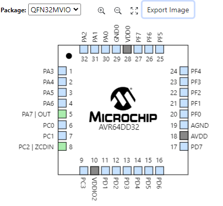

# Self Learning Evaluation

### Capstone Member: Kaleb Lenfest

### Sprint Name: Getting Started with MPLABX

### Link to Taiga Task: [Task 205](https://tree.taiga.io/project/bookstrong-introduction-to-microcontroller/task/205)

### Sprint Topic: MPLABX IDE Overview and Setup (In progress)

---

### Document your research in this section

In looking in to MP LAB X, I looked at: 
- Creating a project
- Importing a project and running it
- Project structure system
- Pin configuration
- Other settings

The project I chose to look at was the ZCD (Zero-Cross Detector) project which I found using the MPLAB Discover tab within MPLAB X. 

### ZCD Project

I chose to import the ZCD (Zero-Cross Detector) program that I found while searching in the MPLAB Discover tab, 
found [Here](https://mplab-discover.microchip.com/com.microchip.ide.project/com.microchip.mcu8.mplabx.project.avr64dd32-getting-started-with-zcd-mplabx-mcc)

The import process was very simple, finding the necessary project file after installing and setting it as the main project gave no issues, however, there was some 
issues I ran into when trying to select my device, despite having it plugged in. This seemed to be due to different versioning between my DFP packs and the XC8 compiler 
used for the project. 

Another snag I ran into was finding out how to manage the pins on the board, but was able to find this after using the MCC (Microchip code configurater)

Here I am able to see the pins being used by the program, which will be useful going forward in any program we make with the board

### What went well during the learning process?

- I was able to easily create a project with minimal errors
- Navigation seemed fairly standard in terms of layout
- Missing libraries and other parts were easy to locate and install

### Were there any topic(s) that were difficult to understand during the learning process?

- What to have installed for proper function
- Finding where tabs and functionality are

### What troubles/issues did you encounter while working with the MPLABX system?

- Knowing what to have installed was a little troubling, especially with the defaults being effectively install everything
- Figuring out how to manage board specific things like the pins

### If you encountered any issues while working with MPLABX, were you able to fix them? If so, what steps did you take to fix the issues you encountered?

- Having the wrong compiler installed, able to go to their website and install the correct one
- Missing packages needed to create a new project for the AVR64DD32 Curiosity Nano, package manager in MPLAB X had a way to install them
- Looking at the sponsor's video tutorial
