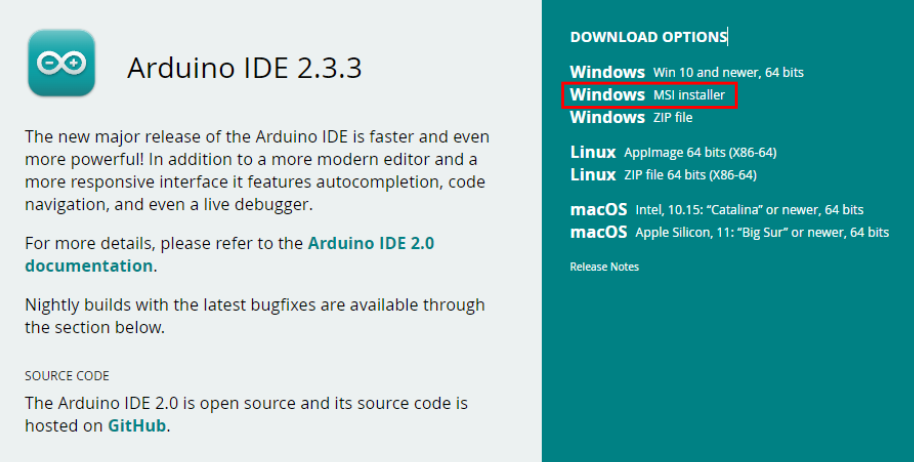
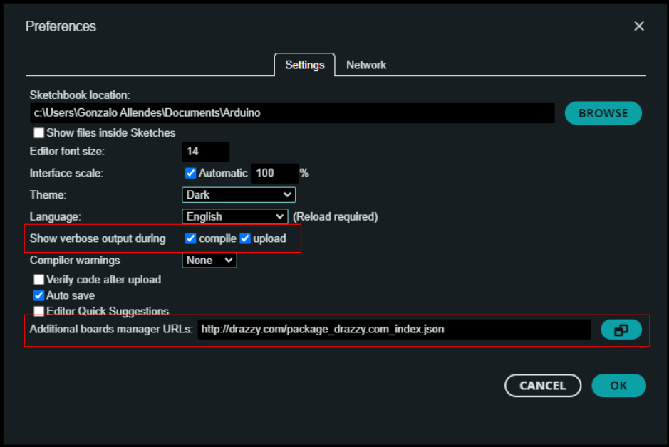
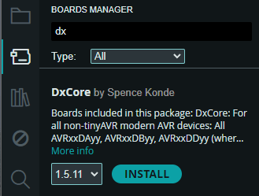
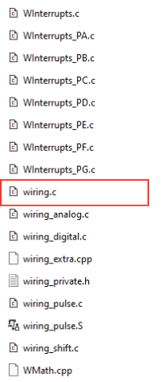
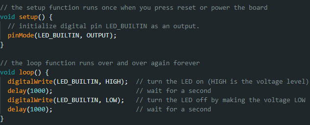

# **Quick Start Guide**

### 

## Required Materials

This lab requires the following materials:

* Desktop or Laptop Computer (Windows is highly recommended).  
* Web Browser (Chrome, Edge, Firefox).  
* Access to the Internet.

This lab was designed to work with Windows operating systems. For other operating systems, steps may differ from what is listed in this lab manual.

## Learning Objective
This Guide is designed to equip you with the fundamental skills that you will need while working with Arduino and Curiosity Nano. By completing this Quick Start Guide you will be able to: 
1. Set up the Arduino development environment. This will include how to download and install the Arduino IDE software.
2. Be able to navigate through the Arduino environment. This will include installing the needed board support package for AVR boards.
3. Understand Arduino code structure. This will include the core concepts of Arduino programming such as setup(), loop(), pinMode(), digitalWrite() and delay().

This guide will provide you with a foundation for learning electrical circuits and prepare you for the rest of the labs that you will take.

## Installation Walkthrough

1. Go to the Arduino Software page ([https://www.arduino.cc/en/software](https://www.arduino.cc/en/software)).  
2. Download and run the MSI Installer (Windows).  
3. The IDE should be immediately installed. Run it and allow it some time to install dependencies.

4. Go to File \-\> Preferences and under the Settings tab, check **'compile'** and **'upload'** to enable verbose output.  
5. Under the same tab, click on the icon next to 'Additional Board Manager URLs'  
6. Copy and paste the following URL into the text box and click OK.  
   * [http://drazzy.com/package\_drazzy.com\_index.json](http://drazzy.com/package_drazzy.com_index.json) [^1]

7. Go to the Board Manager by clicking on the second icon from top to bottom on the left panel.  
8. Type 'DxCore' and click INSTALL. This installs the primary support package.[^2]

## Tour of the Source Files

1. Open File Explorer. Go to C:\\Users\\{YourUsername}  
2. Show hidden files (See Appendix) and go to AppData\\Local\\Arduino15\\packages\\DxCore\\hardware\\megaavr\\1.5.11  
3. This directory is the collection of C, C++, assembly, and header files that support the AVR Dx microcontroller panel.    
4. Go to cores\\dxcore.  
5. Open wiring.c with the IDE of your preference.  
6. In ***wiring.c*** you will find an implementation of the Wiring API specifically designed for the AVR Dx microcontrollers.  
7. Check out the millis() function\!

## Sample Code and Basic Functions

1. Go to File \-\> Examples \-\> 01.Basics \-\> Blink  
2. Arduino is based on a language called Wiring. It's basically C++.  
3. In a sketch, there are two primary functions.  
   * setup()  
   * loop()  
4. The premise behind Arduino sketches is calling setup() once, and loop() to start an infinite loop.  
5. The basic functionality of a Microcontroller includes  
   * pinMode()  
     1. In Microcontroller space, GPIO pins can be input or output.  
     2. In modern ones, they can be both at the same time, which is important for fault tolerance or error checking.  
     3. In general sense, pinMode() sets pin as either input or output  
     4. The macro LED\_BUILTIN matches pin number.  
   * digitalWrite()  
     1. Sets target to either HIGH or LOW.  
   * delay()  
     1. Takes an argument in milliseconds.

## Appendix

Instructions to show hidden files in Windows

1. In File Explorer, click the ellipsis icon on the toolbar (...).  
2. Select Options from the dropdown menu.  
3. In the Folder Options window, go to the View tab.  
4. Scroll down and select *Show hidden files, folders, and drives* under 'Advanced settings'.

[^1]:  Enables access to external microcontroller libraries not included in the default setup.

[^2]:  Arduino had general libraries to support sensors, but as vendors started making boards, board-specific libraries became an independent category of libraries known as core libraries
