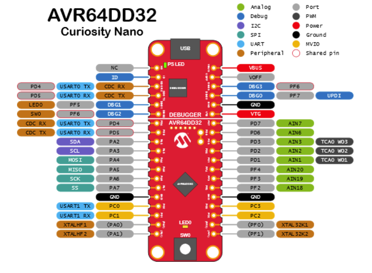

# **Lab 1: Blink an LED\!**

## Required Materials

This lab requires the following materials:

* A desktop or laptop computer  
* Arduino IDE (Go to [https://www.arduino.cc/en/software](https://www.arduino.cc/en/software) if not installed already)  
* DXCore support library  
* AVR64DD32 Curiosity Nano evaluation kit  
* Standard USB A to Micro USB cable (or a Micro-AB cable) with data transfer support [^1]

[^1] Most USB cables support data transfer capabilities; however, if Arduino IDE is unable to locate the board, this usually indicates that the cable does not support data transfer.

## Learning Objectives

This lab is intended to give you an understanding of how to deploy a basic program to your Curiosity Nano board. Along the way, you will learn:

1. How to identify pins on the Curiosity Nano board (and their associated number in code)   
2. A few basic methods common to almost all programs run on the board  
3. How to blink an on-board LED.

Throughout this lab, you will gain a greater understanding of how to work with the board through Arduino IDE, deploy code to the Curiosity Nano board, and identify features on the board.  

## The “Sketch” File

A “sketch” file is a **program** that is uploaded onto an Arduino board by Arduino IDE. Sketch files contain **functions**, which are grouped lines of code that can be called from anywhere in the program. A function contains a header, which details the function name and what values it requires, and a body, that details what code should be run when the function is called.  


The basic functionality of a microcontroller includes:

* **setup** – runs once during program execution  
* **loop** – runs infinitely during program execution  
* **pinMode** – labels a specific pin as a source to read from (input) or as a source to write to (output)  
* **digitalWrite** – sets a pin’s voltage to either LOW (0V) or HIGH (5V or 3.3V).  
* **delay** – tells the sketch to wait a specified number of milliseconds before running the next line

The **setup** and **loop** functions need to be defined with a function body, while the **pinMode**, **digitalWrite**, and **delay** functions can be called without defining a function body. This is because setup and loop are **special functions** that are called by the Arduino program and contain the main functionality of the sketch.

## Lab Setup

1. Go to File \-\> Examples \-\> 01.Basics \-\> Blink  
2. Add the line ```#define CNANO_LED 25``` before the setup function.
3. Replace all instances of ```LED_BUILTIN``` with ```CNANO_LED```.


## Loading Code onto Board

1. Ensure your board is connected to a USB port on your computer.
2. In the top left corner of the Arduino IDE, click the dropdown menu next to the three buttons shown in the image below.


   
3. Select "Other Boards and Ports."
4. Search for and select AVR DD-series (no bootloader) from the list.
5. Choose the appropriate port for your device, typically labeled as COM# Serial Port (USB), where the number sign represents the specific number assigned by your computer. If multiple ports are listed, you can identify the correct one by opening your computer's Device Manager and checking under the Ports section. Refer to the image below for guidance.


   
6. Once you’ve selected the correct board and port, click OK.
7. Navigate to the Tools tab and verify that the Chip is set to AVR64DD32 and the Programmer is set to Curiosity Nano (nEDBG, debug chip: ATSAMD21E18). If these settings are incorrect, click on each section to select the appropriate chip and programmer. See the image below for reference.


   
8.Next, click the Verify button (the one with the checkmark) located at the top left corner of the screen. Refer to the image below for visual assistance.


  
9. Finally, click on Sketch in the toolbar and select Upload Using Programmer. This action will download the code to the microcontroller.

## Pin Basics
The Curiosity Nano board we are using for this lab has 28 pins that can be controlled by the Arduino. Each pin serves different functions. In Lab 1, we will focus on GPIO pins. GPIO stands for General-Purpose Input/Output. These pins can either send or read binary values (1's and 0's), which allows them to control devices like LEDs, read button states, or communicate with external devices.

Of the 28 pins, 25 can function as GPIO pins, with pin PF5 tied to an onboard LED, making it usable only as an output pin. The GPIO pins are shown in gray in the pinout image below.

When using GPIO pins in Arduino, we need to define each pin before using it. Since Arduino can program various boards, each pin is assigned a number. For our board, the pins are numbered 0 to 27. The corresponding pin numbers can be seen in the image below.


To define a pin in Arduino, you will use the following syntax:

      #define nameUsedForPin number

In the setup method, you initialize the pin with:

      pinMode(nameUsedForPin, OUTPUT);

For example, to define pin PF5 (pin 25), you would write:

      #define LEDPin 25
      pinMode(LEDPin, OUTPUT);

This sets up pin 25 (PF5) as an output pin.

To change the pin's output, you can use the following commands:

To set the output to 1 (HIGH):

      digitalWrite(pinName, HIGH);

To set the output to 0 (LOW):

      digitalWrite(pinName, LOW);

Below is an example code to make pin PF5 blink an LED:


      #define LED_Pin 25

      // The setup function runs once when you press reset or power the board
      void setup() {
        pinMode(LED_Pin, OUTPUT);  // Initialize pin PF5 as an output
      }

      // The loop function runs over and over again
      void loop() {
        digitalWrite(LED_Pin, HIGH);  // Turn the LED on
        delay(1000);                  // Wait for a second
        digitalWrite(LED_Pin, LOW);   // Turn the LED off
        delay(1000);                  // Wait for a second
      }
