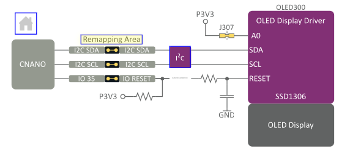
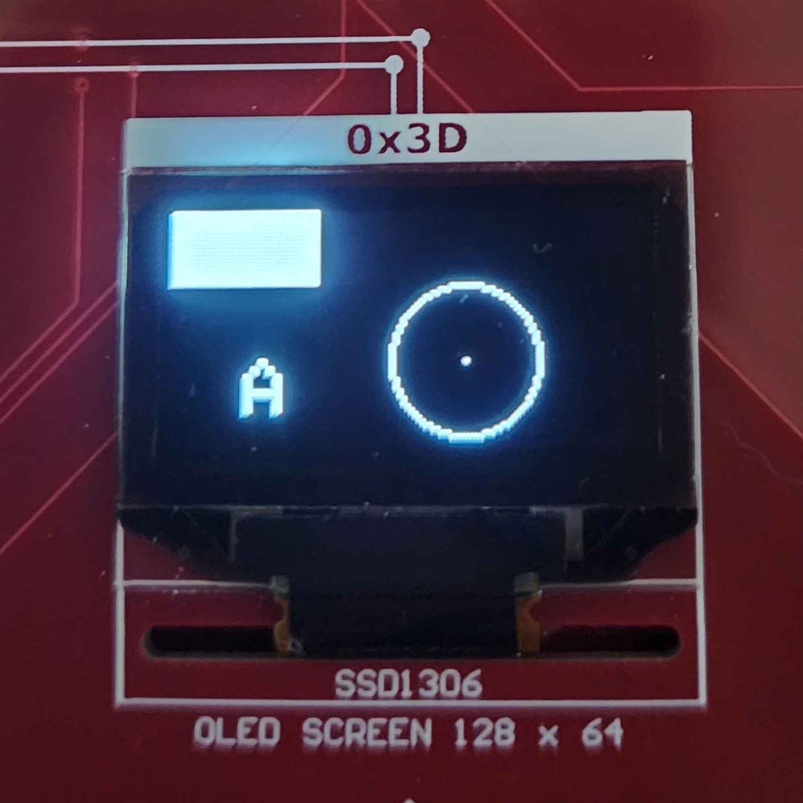

**Intro to Curiosity Nano Explorer board**
The Curiosity Nano Explorer Board is a versatile development platform designed for rapid prototyping and learning. It supports all Curiosity Nano boards and features a variety of onboard components, making it easier for users to learn how to control microcontrollers and interface them with sensors, peripherals, and output devices. This board is ideal for students, hobbyists, and developers seeking hands-on experience in embedded systems and IoT applications.

The Explorer Board offers the following key features:

* Remappable Pinout: Allows flexible configuration of pin assignments to adapt to various project requirements.

* On-Board Peripherals:

  * Communication: USB-to-UART/I2C bridge and I2C I/O expanders for reliable data transmission.
  * Power Management: Includes a power monitor, voltage references, and power switches to     manage and monitor power usage efficiently.
  * Sensors: Features a temperature sensor, microphone, touch controller, and light sensor for environmental data collection and interaction.
* Output Devices:

  * Equipped with LEDs, an OLED display, a speaker, digital-to-analog converters, and servomotor drivers, allowing users to create interactive outputs.
* Connectivity Options:

  * Offers Grove I2C, mikroBUS, Qwiic I2C connectors, and a MicroSD card slot, providing flexibility in connectivity for external devices and modules.
* Power Supply:

  * Powered via an onboard USB Type-C connector, with external power options and various power management ICs to support diverse power requirements.
In this lab, we will explore the setup of the Explorer Board and learn how to use I2C to control LEDs, NeoPixels, and an LCD screen, building a foundation for understanding microcontroller-based systems.

**Installing needed Libraries**
The Arduino IDE utilizes libraries that simplify working with specific chips and components. For this lab, we’ll use libraries provided by Adafruit. Follow these steps to install them:

1. Open the Arduino IDE.
2. On the left-hand side, click the icon that resembles a set of books (library manager icon), as shown in the image below.
   
3. In the search bar, type "Adafruit GFX". Locate the library named "Adafruit GFX Library" and click Install (see image below).
   
4. Click Install All when prompted.
5. Next, search for "Adafruit SSD1306" and install the library labeled "Adafruit SSD1306", as shown in the image.
   
6. Again, click Install All when prompted.
7. Finally, search for "Adafruit MCP23008" and install the "Adafruit MCP23008 Library" as shown.
   
8. Click Install All to complete the installation process.

These libraries will support the components we’ll use in the lab, enabling smoother control over displays, sensors, and other connected devices.


## Working with the OLED Display

The SSD1306 is a OLED display located towards the bottom right of the Curiosity Explorer Board. The display functions as a digital screen, with the capability to draw pixels in a 128-pixels wide by 64-pixels high grid. The display does not support color, meaning pixels can only be ON or OFF.


The SSD1306 is connected to the I2C-SDA and I2C-SCL hookups. The SDA is used for data transfer while the SCL is used to synchronize communication. These pins are already connected to the Curiosity Nano.



Working with the SSD1306 requires the Adafruit GFX and SSD1306 libraries, along with their dependency libraries:

```
#include <SPI.h>
#include <Wire.h>
#include <Adafruit_GFX.h>
#include <Adafruit_SSD1306.h>
```

To interact with the display, we need to create an instance of the `Adafruit_SSD1306` library with a few values:

```
#define SCREEN_WIDTH 128      // OLED display width, in pixels
#define SCREEN_HEIGHT 64      // OLED display height, in pixels
#define OLED_RESET -1         // Reset pin, set to -1 to share Arduino reset pin
#define SCREEN_ADDRESS 0x3D   // 7-bit I2C Address, see CNANO-Explorer User Guide 6.3.7

Adafruit_SSD1306 display(SCREEN_WIDTH, SCREEN_HEIGHT, &Wire, OLED_RESET);
```

We now have a global variable named `display`. Then, in the `setup()` function, we need to add the following code to ready up the display:

```
void setup() {
  delay(1000); // Wait for the display to ready

  if (!display.begin(SSD1306_SWITCHCAPVCC, SCREEN_ADDRESS)) {
    for(;;); // Display not connected or malfunctioning, loop forever
  }

  // ...
}
```

This allow us to use the library's functions to draw pixels on the screen. The origin point (x=0, y=0) is located at the top left of the screen, as pixels are draw left to right, up to down. Since the SSD1306 does not support color, all color values will always be 1 (white) or 0 (black). The library includes functions for drawing<sup>1</sup><sup>2</sup>, most notably:

- clearDisplay() - Clears the screen of all active pixels.
- drawPixel() - Draws a single pixel at the given position
- drawLine() - Draws a line between two given positions on the screen.
- drawRect() - Draws a rectangle of a given width and height from a given screen position. Use fillRect() to draw a filled in rectangle.
- drawCircle() - Draws a circle of a given radius from a given screen position. Use fillCircle() to draw a filled in circle.
- drawTriangle() - Draws a triangle from 3 given positions. Use fillTriangle() to draw a filled in triangle.
- drawChar() - Prints a character at a given position of a given size.
- drawBitmap() - draws a 2D image using a given character array with a given width and height at a given position.

<sup>1</sup>Drawing methods can be found in the Adafruit_GFX.h file in the repository: https://github.com/adafruit/Adafruit-GFX-Library/

<sup>2</sup>Basic methods can be found in the Adafruit_SSD1306.h file in the repository: https://github.com/adafruit/Adafruit_SSD1306/

When drawing on the SSD1306, calling draw functions will not automatically show up on the display. To fix this, we need to follow up draw function with `display()`.

```
  display.fillRect(0, 0, 40, 20, 1);  // Draws a 40px by 20px rectangle at (0,0)
  display.drawPixel(80, 40, 1);       // Draws a pixel at (80, 40)
  display.drawCircle(80, 40, 20, 1);  // Draws a circle with 20px radius at (80, 40)
  display.drawChar(20, 40, 'A', 1, 0, 2); // Draws 'A' of size 2 at (20,40)

  display.display(); // Display draw operations on screen
```

Note: Calling `display()` multiple times will not visibly do anything, unless additional draw operations are used.



In the next section, you will learn how to display an image onto the SSD1306 board.

#### Displaying an Image Lab
