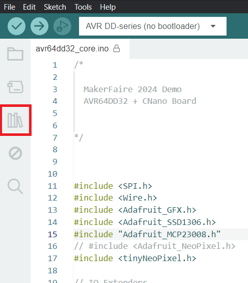
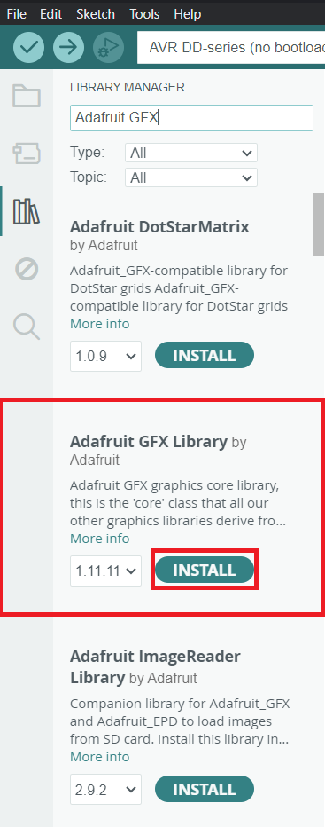
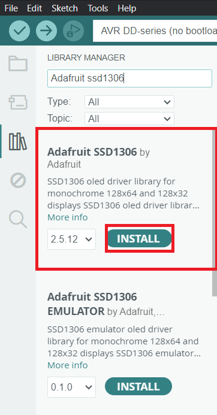
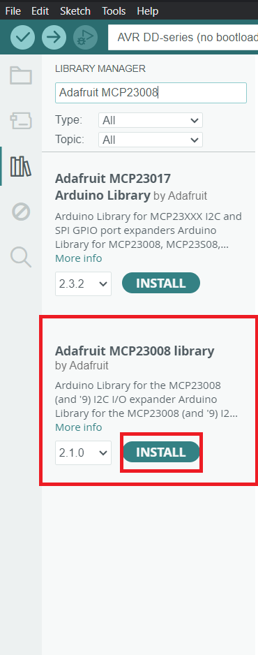

**Intro to Curiosity Nano Explorer board**
The Curiosity Nano Explorer Board is a versatile development platform designed for rapid prototyping and learning. It supports all Curiosity Nano boards and features a variety of onboard components, making it easier for users to learn how to control microcontrollers and interface them with sensors, peripherals, and output devices. This board is ideal for students, hobbyists, and developers seeking hands-on experience in embedded systems and IoT applications.

The Explorer Board offers the following key features:

* Remappable Pinout: Allows flexible configuration of pin assignments to adapt to various project requirements.

* On-Board Peripherals:

  * Communication: USB-to-UART/I2C bridge and I2C I/O expanders for reliable data transmission.
  * Power Management: Includes a power monitor, voltage references, and power switches to     manage and monitor power usage efficiently.
  * Sensors: Features a temperature sensor, microphone, touch controller, and light sensor for environmental data collection and interaction.
* Output Devices:

  * Equipped with LEDs, an OLED display, a speaker, digital-to-analog converters, and servomotor drivers, allowing users to create interactive outputs.
* Connectivity Options:

  * Offers Grove I2C, mikroBUS, Qwiic I2C connectors, and a MicroSD card slot, providing flexibility in connectivity for external devices and modules.
* Power Supply:

  * Powered via an onboard USB Type-C connector, with external power options and various power management ICs to support diverse power requirements.
In this lab, we will explore the setup of the Explorer Board and learn how to use I2C to control LEDs, NeoPixels, and an LCD screen, building a foundation for understanding microcontroller-based systems.

**Installing needed Libraries**
The Arduino IDE utilizes libraries that simplify working with specific chips and components. For this lab, we’ll use libraries provided by Adafruit. Follow these steps to install them:

1. Open the Arduino IDE.
2. On the left-hand side, click the icon that resembles a set of books (library manager icon), as shown in the image below.
   
3. In the search bar, type "Adafruit GFX". Locate the library named "Adafruit GFX Library" and click Install (see image below).
   
4. Click Install All when prompted.
5. Next, search for "Adafruit SSD1306" and install the library labeled "Adafruit SSD1306", as shown in the image.
   
6. Again, click Install All when prompted.
7. Finally, search for "Adafruit MCP23008" and install the "Adafruit MCP23008 Library" as shown.
   
8. Click Install All to complete the installation process.

These libraries will support the components we’ll use in the lab, enabling smoother control over displays, sensors, and other connected devices.
